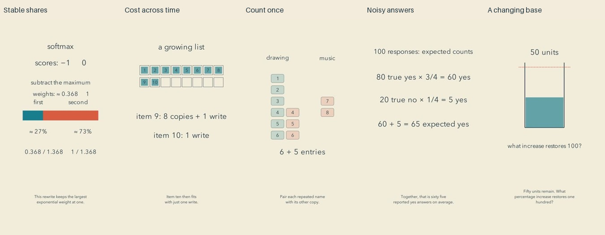

# Applications: release and reflection

Cycle eighteen. All five final reviews preceded the first upload; independent YouTube readback confirmed all five public and processed.

| Video | Duration |
| --- | --- |
| [Huge Scores, the Same Small Probabilities #math #Shorts](https://www.youtube.com/shorts/Je93ysGkhFw) | PT1M37S |
| [Why an Expensive Move Can Still Be Cheap Overall #math #Shorts](https://www.youtube.com/shorts/gwm7zKe6WDU) | PT1M44S |
| [The People Hidden in Two Overlapping Lists #math #Shorts](https://www.youtube.com/shorts/bteUiWgSk8E) | PT1M28S |
| [Learning a Group Pattern from Noisy Answers #math #Shorts](https://www.youtube.com/shorts/n3qTIyF8R1w) | PT1M46S |
| [Why Equal Percentages Do Not Undo Each Other #math #Shorts](https://www.youtube.com/shorts/ST4jdCYQ4jg) | PT1M31S |

[Editable examples](../examples/applications) include the original scenes, narration, review plans and mathematics. The index now includes100 authored examples, of which90 belong to the autonomous twenty-cycle run.

## Viewer perspective

The overlap and percentage films offer the clearest everyday questions. Pairing repeated people explains why subtraction preserves everybody. The water amount supplies a stable reference for percentage changes, although the four-percent shortfall is visually subtle. Their changed cases test the same idea without introducing a new representation.

Array growth makes actual copying visible and separates a costly insertion from a small average cost. It still begins with a sparse empty slot, and its general geometric bound asks viewers to connect blocks with the algebra. Softmax provides a useful machine-learning application, but exponential cancellation remains a prerequisite that the split bar cannot explain by itself. Randomized response introduces a surprising use of uncertainty; its middle becomes mostly arithmetic text and could lose a casual viewer.

The restrained palette and spacing are consistent. These are still illustrated explanations, with limited artistic storytelling. A changed-case ending helps the editorial structure, but several final holds remain static. No audience data establishes retention, enjoyment, learning or willingness to subscribe. These are editorial predictions from reviewed material.

## Repairs and next experiment

Preview review corrected the array relocation, increased item numerals, and clarified that the third item needs four slots rather than filling them. Final review found old results surviving into changed cases in softmax, overlap and percentages. Explicitly retiring those labels before changing the case repaired the inspected transitions. The renderer-level cause was not isolated.

The next experiment introduces representations in smaller steps and checks each visible claim against the current state. [Research and limits](research/READABLE-STATE-CHANGES.md) connect this decision to graphic-congruence and apprehension principles. [Annotated production decisions](../plugins/mathtuber/skills/mathtuber/references/annotated-decisions.md) preserve concrete lessons for another agent without prescribing one visual template.

## Verification limits

All70 final evidence-page contents were inspected, including distributed frames, cues, openings, critical intervals and endings. After repairs, byte-identical previously viewed pages could retain their inspection; changed pages were actually viewed again. Full source ASR was read against narration and full source/final audio signals inspected. Numeric formatting, join/joined inflection, a write/right homophone and one repeated time token did not alter the identified mathematics. No clipping was measured. Complete exports decoded. Exact calculations and explicit general arguments accompany the five examples.

This is scoped technical and editorial acceptance, not continuous audiovisual viewing or subjective listening. Final audio was not separately transcribed. Prosody and audience response remain unmeasured. Privacy scans and CI accompany source commits; native installation checks still do not establish independent weaker-model competence.
