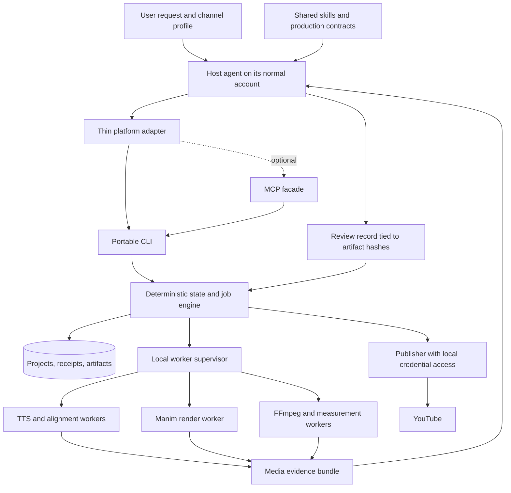

# SmartUber Agentic — architecture and implementation plan

Design proposal · 5 September 2026 · working repository name: `smartuber-agentic`

**Recommendation:** create a new repository containing shared agent skills, a deterministic local production engine, and thin platform adapters. The installed host agent researches, scripts, writes animation code, inspects rendered evidence, and makes revisions. Local workers synthesize speech, render scenes, measure results, assemble exports, and publish through YouTube OAuth.

This is a plan, not an implementation or a compatibility certification. No new GitHub repository, model installation, credential migration, or upload has been performed.

**Non-negotiable product requirement, clarified by the user:** the new system must be agentic first, more economical and faster, and produce substantially better videos than the old system. Modern model capability is a starting assumption, not sufficient evidence that those requirements have been achieved. The release gates below make this measurable.

## 1. What the existing project teaches us

Inspected SmartUber commit `7bc16868319b8422efdc24e207975777d8896bd0`, including the actual orchestration, producer, teacher, TTS, grouping, assembler, executor, and uploader implementations. Inspected omniplugin commit `3b72803214fd3fc3becbc68ea2d31b9d9d4999bf` and its skill/playbook.

The old system is already richer than a single prompt pipeline. It includes research, narrative arcs, scene design, audio-first timing, continuous scene groups, low-quality previews, multiple critique loops, resume artifacts, knowledge distillation, and upload/analytics integration. [Original repository](https://github.com/nagisanzenin/smartuber).

I inspected the public channel grid and a playing excerpt of the Game of Hex Short. Dark backgrounds, muted warm/cool accents, mathematical objects, and small mascots form an identifiable visual style. This was a visual sample, not a full audit of the channel's videos or audio. Preserve the identity while explicitly testing phone readability, label contrast, caption placement, and the visibility of the active mathematical object. [Channel](https://www.youtube.com/@IVisualizeThings/shorts), [sample Short](https://www.youtube.com/shorts/7ZFLTLAkEPs).

| Existing part | Treatment in the new repo |
|---|---|
| Research, narrator, director, designer | Convert useful expertise into short skills and shared reference documents. Host agent performs the work. |
| Producer and teacher model calls | Replace with the host agent's native code editing and multimodal review. Retain acceptance criteria and useful repair cases. |
| Audio-first timing and scene grouping | Preserve the concepts; implement explicit cue timing and group dependencies. |
| Executor and FFmpeg assembler | Rebuild as testable workers with reliable failure handling and measurable outputs. |
| Gemini TTS | Retain as an optional provider and quality benchmark; add local providers. |
| YouTube OAuth and resumable uploads | Reuse protocol knowledge and selected tested logic; separate credentials and upload policy from rendering. |
| Aesthetic guidelines and successful scenes | Curate into a channel profile and a small tested component library. |
| Global knowledge and science experiments | Import selectively with provenance; move analytics-driven iteration to a later phase. |
| Model routers, API-key rotation, token-price plumbing | Remove from the main creative workflow. |

Concrete issues visible in the old code inform the redesign:

- `agents/ffmpeg_assembler.py::_run_grouped` skips missing video/audio and failed merges, then can assemble the remaining clips. New exports must match the complete approved timeline.
- `_merge_video_audio` can clone the final frame to cover an audio gap. A long frozen tail must be a detected issue, not an automatic quality fix.
- `utils/executor.py` inherits the process environment and relies on the working directory for imports. New workers get explicit paths and an allowlisted environment.
- `agents/producer.py` mixes provider selection, code generation, rendering, critique, repairs, state, and knowledge handling. Those responsibilities need clear boundaries.

## 2. Product contract

After installation and one-time setup, the user can say:

> Create a 2–3 minute YouTube Short explaining why the sum of the first n odd numbers is n squared. Use the I Visualize Things style and publish it to my channel.

The plugin resolves a production brief, creates and verifies the video, prepares captions and metadata, and uploads according to the user's configured publishing policy. It reports the resulting file and, when published, the YouTube URL.

Default assumptions for the first implementation: English narration, 9:16, 1080×1920, 30 fps, roughly 150 seconds, one clear learning objective, and the existing channel aesthetic. These are profile settings, not questions repeated for every video.

Three explicit output modes:

1. **Create:** produce the verified local deliverables.
2. **Upload draft:** upload privately and report processing status.
3. **Publish:** upload and make public or schedule publication when the request or saved channel policy authorizes it.

An explicit request to publish should not introduce another plugin-level confirmation after every scene or at the end. Host permissions still apply. Merely having credentials does not make every future create request a publish request.

“Whatever agentic platform” means a capability-based compatibility target. A host needs file access plus shell execution or access to our worker tools. Multimodal review also needs a way to deliver media to its model. A closed chat UI without those capabilities cannot become a local production workstation through a manifest alone.

## 3. Architecture and responsibility boundaries



**Host agent:** owns creative choices, mathematical reasoning, source research, explanation, scene code, interpretation of review evidence, and edits. Use its current model and subscription through the host's normal workflow. The plugin does not extract subscription tokens, emulate private APIs, or assume one platform's account works in another.

**Portable engine:** owns project creation, schema checks, legal state transitions, job leases, dependency invalidation, artifact hashes, retry budgets, complete-timeline checks, and receipts. It does not call a reasoning LLM or pretend a render command made an editorial decision.

**Workers:** perform bounded mechanical tasks. Media dependencies live in separately provisioned environments. MLX, PyTorch, Manim, FFmpeg, and Google's client libraries do not get imported by the lightweight state engine.

**Adapters:** register skills/tools, resolve installation roots, deliver review media, and optionally map native subagent or wakeup mechanisms. They contain no duplicate production logic.

Apply omniplugin's shared skills, shared state, CLI fallback, thin adapters, and explicit verified-status discipline. Keep the portable control engine stdlib-only and free of network code; media and publishing workers are an intentional additional dependency layer. Installing skill text alone cannot install FFmpeg, TeX, or model weights. [Omniplugin playbook](https://github.com/nagisanzenin/omniplugin).

MCP is an optional typed transport over the same commands, useful for media delivery and tool-only hosts. It must not become a second workflow implementation or a required server for shell-capable hosts.

## 4. End-to-end production workflow

1. **Preflight.** Resolve the profile, runtime versions, output directory, free space, local models, host media capabilities, publishing intent, and budget. Run a small media-delivery probe when host capabilities are unknown.
2. **Research and solve.** Write the correct solution first. Record assumptions, domain restrictions, sources, derivation, numerical examples, and common misconceptions. Use SymPy or numerical checks where appropriate; examples alone are not a proof.
3. **Design the explanation.** Choose one learning outcome and the visual mechanism that makes it understandable. Build a hook, setup, transformation or argument, and payoff. Distinguish a proof from an illustrative simulation.
4. **Plan timing.** Set a target such as 150 seconds. Roughly 280–340 spoken words is a starting editorial budget at a deliberate pace, not a timing guarantee. Reserve pauses for examining diagrams.
5. **Draft narration and visual beats together.** Keep display math separate from speech text. For example, render `x²` but speak “x squared.” Store pronunciation overrides and one canonical meaning for each claim.
6. **Synthesize narration by meaningful sections.** Use complete thought units, usually 15–40 seconds, to balance prosody and economical retries. Pin the voice and synthesis settings for the whole video.
7. **Measure and align.** Use the actual WAV duration and alignment timestamps. Bind animation cues to phrases. If the narration is too long, revise it before expensive rendering.
8. **Write and preview scenes.** Generate editable Manim code using the shared component library. Render low-resolution previews with the intended aspect ratio. Keep continuous transformations in the same group.
9. **Review and repair.** Inspect equations, geometry, motion, narration correspondence, readability, and transitions. Report concrete defects with timestamps and evidence. Revise only affected dependencies.
10. **Render final and assemble.** Build the complete video, captions, audio mix, and metadata. Perform a fresh review of the assembled export because transitions, captions, and encoding introduce new defects.
11. **Publish when requested.** Verify the export hash, timeline completeness, review status, destination channel, and policy. Upload resumably, verify processing, then apply the authorized visibility or schedule.
12. **Return deliverables.** Final MP4, SRT/VTT, metadata, editable sources, review report, and publication receipt. Save a compact recovery record throughout.

The main loop is one capable agent using tools. Separate research, animation, and critic subagents are optional optimizations for hosts that support them, not a prerequisite. A fresh critic context can reduce anchoring but does not guarantee independent mathematical judgment.

### Agentic control, not a fixed chain of model prompts

The numbered workflow describes dependencies and required outcomes. It does not prescribe one model call per step or require every project to traverse identical creative stages. The host agent can solve and storyboard together, prototype a difficult construction before drafting narration, inspect a suspected defect, replace a weak visual metaphor, or return to the explanation when animation repairs would not solve the problem.

Give the agent a compact objective, current production state, budget, relevant references, and useful tools. Let it choose its next action. `project next` returns prerequisites and legal actions, not an order from a hidden orchestration LLM. The engine never re-creates ResearchAgent → NarratorAgent → DirectorAgent as API calls behind a single tool.

For simple problems, the host can produce the solution, script, and scene plan in one coherent pass. Complex proofs may justify a fresh math critic or an early visual experiment. Only independent, well-specified scenes should be delegated concurrently; the primary agent owns the narrative and continuity. Serial execution must remain a complete path.

Skills should teach production judgment with concise examples and references loaded on demand. Avoid giant system prompts, exhaustive rules repeated in every context, mandatory persona debates, and repetitive self-scoring. Use the host's strongest appropriate reasoning/multimodal capability for mathematical and editorial decisions, while deterministic code handles measurement and bookkeeping.

## 5. Scene representation and timing

Use a **small production schema plus editable code**, rather than inventing a new animation language. The manifest describes meaning, assets, timing, and acceptance; Python expresses the actual animation.

```json
{
  "schema_version": 1,
  "scene_id": "s03",
  "group_id": "g02",
  "objective": "Show that the next odd number fills an L-shaped border",
  "claim_ids": ["odd_border_count"],
  "source": "scenes/g02.py",
  "narration_id": "n02",
  "cue_bindings": [
    {"cue": "add_border", "phrase_id": "p07", "offset_ms": 150}
  ],
  "checks": ["border_count_matches_2n_plus_1", "labels_inside_safe_area"],
  "continuity": {"input_state": "square_n", "output_state": "square_n_plus_1"}
}
```

The engine compiles this with measured audio into integer audio-sample and video-frame positions. Retain absolute timestamps as well as local group offsets. Round frame boundaries consistently so hundreds of small rounding errors do not accumulate.

Narration is the primary timing reference once approved; the planned duration remains a constraint. Do not indiscriminately stretch the whole video or accelerate speech to repair an overlong script. Small pauses and deliberate holds are permitted, while substantial mismatch sends the affected section back for revision.

Changing a narration section invalidates its alignment, cue schedule, affected render groups, captions, assembly, and final review. Changing one color normally invalidates its group and final review, not all speech. Shared style or renderer-version changes invalidate all affected renders.

## 6. Multimodal review that works across hosts

A multimodal model and a host that can attach a local MP4 are different capabilities. Detect the delivery path rather than assuming it.

| Capability | Review behavior |
|---|---|
| Native video and audio input | Deliver short scene clips with synchronized narration, followed by final-video review. |
| Image input, with audio available separately | Deliver timestamped frame sequences, full-resolution crops, individual audio sections, and cue data. |
| Image input only | Deliver frame sequences and measured audio/transcript diagnostics; mark acoustic judgment unavailable. |
| No media input | Use an explicitly configured local reviewer or require a separate media-capable review before unattended publication. |

A local path returned as text is not proof the model saw the file. Each adapter must test its actual attachment/read path. Review records include which images/clips were inspected, timestamps, modality coverage, reviewer, artifact hashes, and unresolved issues. Do not call sampled frames a full video watch.

Generate evidence at scene starts/ends, every important cue, and before/during/after transformations. Add regular samples and denser sequences around fast motion or suspected defects. A contact sheet helps navigation; individual full-resolution frames preserve tiny equation details. Reserve final-resolution previews for legibility decisions.

Combine two review layers:

- **Mechanical checks:** decodability, frame dimensions, duration, expected scene coverage, missing media, clipping/silence, caption bounds, cue order, known object bounds, and mathematical assertions.
- **Semantic review:** correctness of the explanation, misleading scales or geometry, whether the visual matches the spoken claim, conceptual omissions, pacing, contrast, and cognitive load.

Mechanical checks catch violations; they cannot certify the proof or detect every visual overlap. OCR is a secondary signal, especially unreliable for small mathematical symbols.

Proposed starting budget: three repair cycles per scene group and two final assembly reviews. Stop early on repeated identical failures. Preserve the best candidate and explain the unresolved defect; never convert exhausted retries into approval. These limits are configurable and measured during the pilot.

## 7. Local stack for the observed M2 / 16 GB machine

The hardware inspection found an Apple M2, 10 GPU cores, and 16 GiB of unified memory. The recommendations below are deployment candidates, not measured performance results.

| Component | Initial choice | Reason and fallback |
|---|---|---|
| Mathematical animation | Manim Community, Cairo renderer, pinned fonts/TeX | Editable, precise vector geometry and formulas. Retain existing experience. Add another renderer only for demonstrated gaps. |
| Composition and measurement | FFmpeg / ffprobe | Export, concatenate, mix, normalize, measure, and extract review frames. Use lossless intermediate audio. |
| Lightweight local speech | Kokoro-82M | First baseline to benchmark; compact enough to prioritize simplicity and resource use. |
| Expressive local speech | Qwen3-TTS 0.6B, then 1.7B if justified, through MLX Audio | Candidate for controllable delivery and voice consistency. Quality on mathematical narration must be measured. |
| CPU alternative | Pocket TTS | Worth an A/B test if CPU deployment or voice cloning is a priority. |
| Additional voice candidate | Chatterbox / Turbo | Evaluate after the first two; keep its dependencies isolated. |
| ASR and alignment | Qwen3-ASR / ForcedAligner through MLX Audio | Benchmark transcript checking and phrase timing on Apple Silicon. Whisper.cpp is an ASR fallback; WhisperX is an alternate alignment stack. |
| Symbolic/numerical validation | SymPy / NumPy worker | Check identities, examples, coordinates, and simulation invariants. |
| Optional local visual reviewer | Small quantized VLM through MLX-VLM | A second signal for obvious defects. Do not assume parity with the host model on proofs or video understanding. |
| Music | Optional curated, licensed tracks | Keep music out of the MVP until speech and diagrams are dependable. |

Manim provides the established animation framework. [Manim documentation](https://docs.manim.community/en/stable/). Kokoro's model card identifies an 82M model with Apache-2.0 weights. [Kokoro model card](https://huggingface.co/hexgrad/Kokoro-82M). Qwen releases 0.6B and 1.7B TTS models with voice-control capabilities; available languages and features depend on the checkpoint. [Qwen3-TTS](https://github.com/QwenLM/Qwen3-TTS).

MLX Audio documents Apple Silicon implementations of Kokoro, Qwen3-TTS, ASR, and forced alignment. That makes it a useful Mac integration layer; lock the tested implementation and model revisions together. [MLX Audio](https://github.com/Blaizzy/mlx-audio), [Qwen3-ASR](https://github.com/QwenLM/Qwen3-ASR). Other candidates: [Pocket TTS](https://github.com/kyutai-labs/pocket-tts), [Chatterbox](https://github.com/resemble-ai/chatterbox), [Whisper.cpp](https://github.com/ggml-org/whisper.cpp), [WhisperX](https://github.com/m-bain/whisperX), [MLX-VLM](https://github.com/Blaizzy/mlx-vlm).

Run one heavy model stage at a time initially. Release TTS memory before alignment or local VLM inference; keep render concurrency at one until measured. Avoid installing every voice stack into one Python environment. Cache model downloads outside the plugin cache so updates do not redownload them.

Keep Gemini TTS as an optional cloud provider during migration. The agent subscription does not automatically supply a programmatically usable TTS API. Local media production plus a cloud host agent also does not mean the whole workflow is offline: research and inspected evidence still travel through that host. A fully offline mode additionally needs a local reasoning/multimodal host and a local source corpus, and cannot publish to YouTube offline.

### Voice benchmark before choosing the default

Compare Kokoro, Qwen3-TTS, and the existing Gemini voice on the same 20–30 passages: exponents, fractions, Greek letters, inequalities, variable names, matrices, theorem names, and long explanations. Include several complete two-minute narrations to test voice drift and joins.

Record pronunciation errors, omitted/repeated words, listening preference, voice consistency, pause quality, peak memory, generation time, and real-time factor. Use independent transcription as a diagnostic plus listening review; ASR can normalize away pronunciation problems. Test equation-to-speech preprocessing separately from voice quality. Preserve exact model/voice revisions, selected licenses, and any reference-voice permission. Pick the default from results, not a leaderboard claim.

Generative raster/video models can later supply decorative assets. Keep mathematical diagrams and proofs in deterministic graphics. Local diffusion video is a poor initial dependency for this M2 budget and the precision this product needs.

## 8. State, jobs, and recovery

Use a configurable `SMARTUBER_HOME` for the catalog and shared profiles, with project artifacts in user-selected writable workspaces. Both platforms must point to the same host storage to share work. A cloud container does not automatically share the Mac's files or credentials.

The engine owns canonical state in SQLite: projects, stages, artifacts, dependencies, jobs, reviews, and publications. JSON/Markdown snapshots are generated for agents and humans; they are not competing sources of truth. The agent edits draft inputs and code, then commits a new artifact version through the engine.

```text
PROJECT: planned → scripted → audio_ready → scenes_ready → assembled → verified
PUBLISH: verified → uploading → uploaded_private → processing → published
SIDE STATES: needs_revision / waiting_for_agent / needs_auth / failed / canceled
```

Transitions require matching artifact versions and checks. Store immutable candidate hashes and atomic outputs. A worker writes a temporary result and only commits a complete validated artifact. Scene jobs use leases and per-project ownership to prevent two hosts from modifying the same active project simultaneously.

Long renders return job IDs. The local supervisor continues mechanical jobs independently of a single tool timeout. It cannot continue creative reasoning when the host agent is unavailable. On resume, `next` returns the current blocker, relevant artifacts, last review, and suggested legal next operations.

Host-native background continuation or a documented authenticated CLI can later resume agent work when supported. Keep this optional and obey the host's account/runtime limits. A universal promise to work unattended forever on any subscription would be inaccurate.

CLI shape (proposed, not implemented):

```text
smartuber doctor --json
smartuber project create --brief-file brief.json
smartuber project next --project PROJECT --json
smartuber artifact commit --project PROJECT --file artifact.json
smartuber audio synthesize --project PROJECT --section n02
smartuber audio align --project PROJECT --section n02
smartuber scene render --project PROJECT --group g02 --quality preview
smartuber job status --job JOB --json
smartuber review bundle --project PROJECT --group g02
smartuber review record --project PROJECT --file review.json
smartuber video assemble --project PROJECT
smartuber video verify --project PROJECT
smartuber youtube status --channel CHANNEL --json
smartuber youtube upload --project PROJECT --intent-file publication.json
```

User text arrives through JSON files/stdin, never interpolated into shell commands. Results return typed error codes, job/artifact IDs, paths, measured metrics, and bounded log tails. Workers must report cancellation, out-of-memory, missing model, render failure, expired auth, and upload uncertainty distinctly.

## 9. YouTube and credential boundary

Support importing the old OAuth configuration from an explicitly located local installation. The old code expects `client_secrets.json` and `youtube_token.json`; these credentials have not been located or validated in this planning pass.

The publisher reads secrets from Keychain or a restricted credential store and exposes only channel identity, scope/expiry health, and success/failure to the agent. Render workers receive neither credentials nor the publisher's environment. Use separate scopes for uploading and optional analytics, rather than forcing analytics consent before basic production works.

Generated Python executes code. An allowlisted environment alone is not filesystem isolation. The production render profile should use a container/VM with only project assets mounted, no credential storage, network disabled, TeX shell escape disabled, and resource/time limits. Local MLX workers remain native and accept data-only requests; generated scene code never runs inside the credential-bearing publisher. A native development renderer must be labeled as weaker isolation, not advertised as sandboxed.

Publication records bind the exact final-video hash, metadata hash, channel ID, requested visibility/schedule, and authorization intent. Edits after verification require fresh checks. Use a durable upload session and video-ID receipt. After an ambiguous network failure, query the existing session/status before retrying; never blindly start another upload. Local deduplication cannot guarantee exactly-once delivery across every remote failure, so unresolved ambiguity becomes an explicit recovery state. [YouTube resumable upload protocol](https://developers.google.com/youtube/v3/guides/using_resumable_upload_protocol).

Upload privately first as an internal staging step, confirm processing, then apply the already-authorized public/scheduled state. If the token expires or the API project is restricted, keep the verified local export and return a precise actionable status.

Two current product constraints belong in preflight:

- Vertical/square videos up to three minutes can qualify as Shorts. For a “2–3 minute” brief, target about 150 seconds and keep a little margin below the limit. Shorts longer than one minute with an active copyright claim are blocked globally; music choice therefore matters. Local software cannot guarantee the absence of a future claim. [YouTube Shorts guidance](https://support.google.com/youtube/answer/15424877?hl=en).
- Uploads from qualifying unverified API projects are restricted to private visibility until the project passes audit. Existing credentials do not establish public-upload eligibility. Read actual API errors/quota status; avoid embedding obsolete quota constants. [YouTube videos.insert](https://developers.google.com/youtube/v3/docs/videos/insert).

## 10. Platform rollout and packaging

| Target | Planned delivery | Status of this new plugin |
|---|---|---|
| Codex | Shared skills, `.codex-plugin` packaging, CLI; optional MCP and media adapter | Documentation researched; implementation and live install not yet tested. |
| Claude Code | Shared skills, `.claude-plugin` packaging; optional native critic | Documentation researched; implementation and live install not yet tested. |
| OpenCode | Shared skills plus thin TypeScript registration adapter | Documentation researched; second rollout wave. |
| Gemini CLI | Extension packaging pointing to shared skills/tools | Documentation researched; second rollout wave. |
| Hermes, Pi, OpenClaw, Antigravity, others | Start with full-repo skills + CLI route; add native glue as tested | Planned; no compatibility certification. |

Current primary docs establish separate packaging systems: [OpenAI plugin packaging](https://developers.openai.com/plugins/build/plugins), [Claude Code plugins](https://code.claude.com/docs/en/plugins), [OpenCode plugins](https://opencode.ai/docs/plugins/), [Gemini CLI extensions](https://geminicli.com/docs/extensions/writing-extensions/). Omniplugin supplies the portability discipline, not proof that this new product works on all of them.

For each release record host version, OS, install route, skill discovery, media delivery, render completion, resume behavior, and publishing capability. Test namespace collisions and full-repository staging. Session hooks should only offer useful recovery context, never start a video or publish just because a session opened.

Installation has two stages: native plugin installation, then `doctor`/setup to provision selected media environments and model weights and connect the channel. No recurring setup questions once the profile is healthy. Uninstalling or upgrading the plugin must preserve projects, credentials, voices, and user profiles.

## 11. New repository structure

```text
smartuber-agentic/
  README.md
  pyproject.toml
  scripts/engine.py             # lightweight entry point
  core/                         # stdlib state, jobs, hashes, transitions
  skills/
    smartuber-create/SKILL.md
    smartuber-revise/SKILL.md
    smartuber-publish/SKILL.md
    smartuber-resume/SKILL.md
    _shared/                    # math, storytelling, timing, review contracts
  workers/
    render/                     # Manim environment and execution boundary
    speech/                     # separate provider environments
    alignment/
    media/                      # ffmpeg and diagnostics
    youtube/                    # privileged OAuth/publishing worker
  components/                   # axes, labels, proofs, cue helpers
  profiles/                     # example channel/format/voice profiles
  schemas/                      # versioned artifact and tool contracts
  adapters/                     # media delivery and optional host glue
  .claude-plugin/
  .codex-plugin/
  .agents/plugins/
  docs/                         # per-platform status and architecture decisions
  tests/                        # engine, worker, recovery, fixture tests
  examples/                     # small reproducible source projects
```

Additional platform-specific root files appear only as their adapters ship. Keep generated videos, model weights, tokens, personal channel profiles, and legacy scratch files out of Git. Introduce a clean license/attribution inventory for imported components, fonts, mascots, and test assets; do not assume the README's license claim covers every asset.

## 12. Implementation sequence and acceptance gates

The effort ranges below are planning estimates for focused engineering with agent assistance, not delivery promises. Voice quality and platform integration are the main uncertainties.

| Phase | Scope | Exit criterion | Estimate |
|---|---|---|---|
| 0 — Baselines | Curate old scenes/style; compare voices; probe media delivery on launch hosts | Recorded baseline, selected voice profile, verified evidence path | 1–2 days |
| 1 — Engine | New repo, versioned schemas, state/jobs, hashes, doctor, worker boundaries | Simulated interruption resumes correctly; missing assets cannot pass | 2–3 days |
| 2 — Vertical slice | One host skill, narration/alignment, Manim preview/repair, final export | One complete 120–175 second math Short produced from one request with zero reasoning API keys | 3–5 days |
| 3 — Robust review | Cue-aware evidence, final QA, revision invalidation, known-defect fixtures | Seeded math, timing, crop, missing-audio, and stale-review defects are detected | 2–3 days |
| 4 — Publishing | Credential import, private upload, processing checks, authorized publication, recovery | One explicitly requested test upload succeeds and interrupted uploads avoid blind duplication | 1–2 days |
| 5 — Launch portability | Native Codex and Claude installs; same project resumed across them | Versioned compatibility receipts, documented fallbacks, clean-machine setup | 2–3 days |
| 6 — Expansion | OpenCode/Gemini and subsequent hosts, local reviewer, analytics | Each platform and feature ships only with its own acceptance evidence | Incremental |

Phases 0–5 suggest roughly 11–18 focused engineering days; revise the estimate after the first full video. Public publishing may depend on external Google account/project readiness.

The first demonstration should be a visual proof such as the sum of odd numbers. Follow it with a continuous-motion topic such as gradient descent and a subtle explanation such as conditional probability. This exercises discrete geometry, timing, and semantic correctness.

Measure: completion rate, critical defect count, render attempts, total elapsed time, peak memory, manual interventions, pronunciation errors, and any separately billed provider usage. Subscription consumption should be recorded only when the host exposes it; do not invent per-video token billing.

Testing priorities:

- Missing/reordered scenes, malformed manifests, stale hashes, and obsolete reviews cannot reach verified state.
- A changed voice invalidates relevant downstream assets; an isolated visual change reuses valid narration.
- Kill and resume during synthesis, rendering, assembly, and upload; verify atomic outputs and leases.
- Use seeded incorrect equations, clipped labels, mistimed reveals, and frozen tails to evaluate review recall.
- Compare renders with geometric/timing tolerances; exact pixel hashes are not portable across fonts and graphics stacks.
- Test publication policy and OAuth errors with fakes; isolate live integration tests from ordinary CI.
- Run install/discovery/media-delivery tests on actual platform versions. Unit tests do not certify a native plugin install.

## 13. Improvements after the core works

**Channel memory:** preserve a style guide, pronunciation dictionary, reusable visual motifs, and source-backed corrections. Retrieve only relevant material per task; do not keep appending huge global prompts.

**Revision-first UX:** “Make the proof slower,” “fix the label at 00:43,” or “use the other voice” should change only dependent artifacts and produce a new reviewed version.

**Analytics-informed iteration:** import view and retention data when available, link it to script beats, and propose experiments. Label conclusions as hypotheses; topic, upload age, distribution, and sample size confound naive comparisons. Synthetic viewer scores are not audience evidence.

**Multiple outputs:** reuse the verified mathematical content while creating separate layouts/timelines for landscape or another language. Re-review each output; translation and cropping can break both timing and meaning.

**Portable project handoff:** export a project bundle with sources, manifests, voice/model references, and receipts so another host can resume it. Exclude credentials; remote workers need explicit authentication and artifact transfer.

**Better components:** promote successful generated constructions into tested reusable Manim helpers. This makes future agents more reliable without locking them into a narrow storyboard template.

## 14. Cost, speed, and substantially higher quality

Optimize **cost and elapsed time per accepted video**, not the number of tool calls or the cheapest first draft. A fast render of a poor explanation is wasted work. A more capable first pass that eliminates several repair loops is often the economical choice.

### Speed and cost mechanisms

| Mechanism | Concrete behavior |
|---|---|
| Native host reasoning | No separately billed reasoning-model API in the default path; normal subscription limits still apply. |
| Compact working context | Load only relevant components, affected scene code, current evidence, and a short issue history. Avoid repeatedly attaching every prior clip or log. |
| Coherent first pass | One host agent maintains the complete explanation instead of paying repeated context/setup costs for a chain of role wrappers. |
| Early risk reduction | Prototype the hardest visual and validate the mathematics before synthesizing the whole script or rendering final frames. |
| Tiered rendering | Use static layout frames for placement, low-resolution motion previews for animation, and full-resolution crops/short excerpts for typography. Produce full-quality groups after substantive defects are fixed. |
| Selective review | Inspect cue-aware evidence and suspect intervals first, then review the assembled result. A passing mechanical check does not excuse semantic review. |
| Incremental rebuilds | Hash narration, voice settings, code, dependencies, renderer, fonts, style, and format. Reuse unchanged valid artifacts; discard stale approvals. |
| Warm local workers | Keep the active speech model loaded across its section batch, then release it before the next memory-intensive stage. Avoid model startup for every sentence. |
| Resource-aware concurrency | Begin with one render/model worker on this M2. Parallelize independent lightweight work and only raise concurrency after memory/latency measurements. |
| Bounded repairs | Diagnose repeated failure patterns and change approach. Do not spend fifteen nearly identical retries polishing an unsuitable construction. |
| Minimal provider surface | Provision the selected local voice and renderer; add other providers only for quality gaps. Cloud fallbacks require a configured spending allowance. |

Model quality can justify fewer redundant critique passes, but not omission of final semantic review. Do not switch to a weaker reviewer simply to reduce a visible cost metric. Host-native model routing is optional and must be supported by that host; it is not an excuse to build another API router.

### What “substantially better” means here

1. The visual carries the explanation: transformations demonstrate the argument rather than decorate spoken text.
2. Every displayed formula, graph, and narrated claim agrees, with assumptions and limits made clear.
3. Voiceover, reveals, and highlights align closely enough to follow without searching the screen.
4. Text and formulas remain legible at phone size and clear of platform overlays.
5. Motion preserves object identity and continuity; the viewer can track what changed and why.
6. Narration sounds deliberate and consistent, with correct mathematical pronunciation and time to think.
7. The final video has a compelling opening and a clear intellectual payoff, without filler inserted to reach duration.

### Comparative release gate

Build a matched set of 8–12 topics spanning discrete proofs, continuous motion, probability, graphs, and algorithms. Include existing channel examples where their sources can be recovered. Compare outputs at matched duration, resolution, language, and topic difficulty.

Run two comparisons when feasible: new production versus published legacy videos for the product outcome, and old versus new workflow using the same current model capability for the architecture's contribution. The second comparison may not be possible if the legacy API/model route is no longer available; record that limitation instead of pretending the gains are isolated.

Proposed initial targets, to be validated and revised after the pilot:

- **Quality:** blind preference for the new videos in at least 80% of paired judgments; score comprehension, mathematical correctness, visual explanation, narration, and polish separately. Report number of videos, raters, and disagreements rather than presenting a small sample as statistical certainty.
- **Correctness:** no known critical mathematical errors, missing scenes, inaudible narration, or materially misleading visuals in accepted outputs. Independent review is necessary; model self-scores alone cannot establish this.
- **Speed:** target at least a 40% reduction in median end-to-end production time against a comparable baseline, including retries. Also report the slowest runs and time to first useful preview.
- **Cost:** zero separately billed reasoning API usage in the default subscription path; target at least a 50% reduction in measured avoidable work, such as redundant rendered frames and repeated context/evidence processing where observable. Report TTS/API charges separately and do not equate subscription usage with zero cost.
- **Autonomy:** at least 9 of 10 benchmark requests reach a verified export without creative or coding intervention. Account consent and a genuinely unavailable external service are recorded separately, not silently removed from reliability statistics.

These are acceptance targets, not results or promises. If quality does not improve substantially, redesign the explanation/visual system before declaring the refactor complete. If quality improves but time increases, investigate work amplification and caching before lowering the quality bar.

## 15. Decisions proposed for the first build

- New repository: `smartuber-agentic`, subject to naming availability.
- Launch on Codex and Claude Code; broaden through omniplugin adapters and honest compatibility reports.
- Shared skills + deterministic CLI; optional MCP facade.
- Manim and FFmpeg for precise local production.
- Kokoro and Qwen3-TTS benchmarked against the existing Gemini narration before choosing the default.
- Measured audio with phrase cues controls animation timing.
- Artifact-bound multimodal review and complete-timeline validation precede publication.
- Agent-selected creative actions, adaptive evidence collection, and incremental builds are required architecture properties.
- Substantially better quality, faster production, and less wasted work must be demonstrated on matched examples before the new system is considered successful.
- Existing OAuth reused through a local publisher; explicit publish requests and saved channel policy allow autonomous release.
- First milestone: a complete, reviewed 2–3 minute video, followed by a real authorized upload and cross-host resume demonstration.
