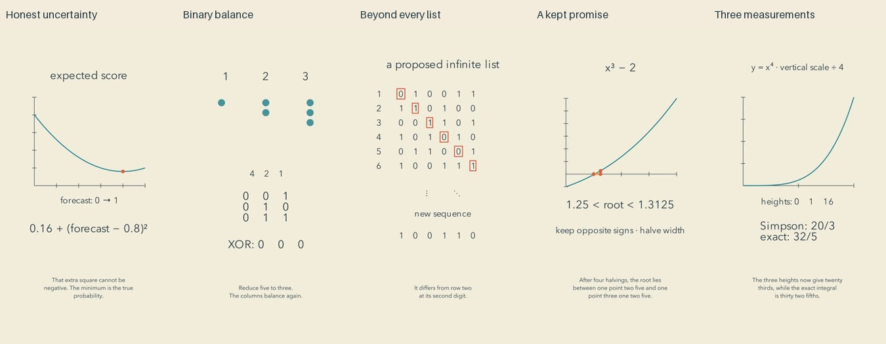

# Arguments: release and reflection

Cycle nineteen. Five scoped final reviews preceded the first upload. Independent YouTube readback confirmed all five public and processed.

| Video | Duration |
| --- | --- |
| [A Score That Rewards Honest Uncertainty #math #Shorts](https://www.youtube.com/shorts/mwJBQGJwG9Y) | PT1M14S |
| [The Binary Balance Hidden in Three Piles #math #Shorts](https://www.youtube.com/shorts/c8uMkHhKtqA) | PT1M21S |
| [The Sequence Missing from Every Infinite List #math #Shorts](https://www.youtube.com/shorts/n_KDFsULeAs) | PT1M12S |
| [A Root Found by Keeping One Promise #math #Shorts](https://www.youtube.com/shorts/GkirLgGKqVA) | PT1M10S |
| [Why the Middle Measurement Counts Four Times #math #Shorts](https://www.youtube.com/shorts/ahXvDo1wRKY) | PT1M17S |

[Editable examples](../examples/arguments) preserve scenes, narration, review plans and mathematical verification. The mechanism index has105 examples:95 from the autonomous run and10 earlier examples.

## Viewer perspective

Nim and diagonalization give viewers objects they can inspect and a construction they can repeat. The finite binary display is explicitly distinguished from the universal argument. Inserting the missing sequence and failing again makes the quantifier meaningful. Nim becomes harder at the highest-bit argument: the explanation is correct, but its static middle asks a new viewer to follow binary reasoning quickly.

The forecast film connects honesty to a loss function with a concrete probability example. Its sparse opening may not stop a casual scroll. A moving minimum makes the changed true probability visible; completing the square still depends on the viewer following the expression. Bisection has a clear shrinking invariant and a useful discontinuous counterexample, although the last bracket is small on a phone. Simpson quadrature links two estimates to exactness on quadratics; its basis-function justification is spoken rather than separately visualized.

The palette is coherent and calm. It is not yet evidence of exceptional artistic storytelling. Several stretches are static diagrams with narration. No measured retention, learning, joy or preference supports a claim that this batch outperforms earlier ones.

## Actual repairs and next decision

Prototype inspection found a Nim note overlapping subtitles. Moving it into unused space above the binary table repaired that overlap. Probability-axis numbers needed an explicit ink color. The forecast expression and an intermediate bisection label were retired before their underlying state changed. Current final evidence was inspected after those repairs.

The final cycle concentrates on comparing two precisely defined quantities or processes: average loss versus loss of an average; two composition orders; independent dice versus a copied roll; unequal inclusion versus zero inclusion; independent attempts versus removal without replacement. This is a design hypothesis, not a tested retention result. Its purpose is to make each assumption produce an observable consequence. [Annotated decisions](../plugins/mathtuber/skills/mathtuber/references/annotated-decisions.md) and [state-change research](research/READABLE-STATE-CHANGES.md) explain the existing rationale.

## Evidence and limits

All65 current evidence pages were actually viewed: distributed timeline, every cue, openings, three critical intervals and endings. Complete source ASR was read against expected narration, and full source/final audio signal measurements inspected. No clipping was measured; maximum low-energy run was1.3seconds. Numeric formatting, Brier/Breyer spelling, an/and and buy/by, omitted changing/now tokens and extra losses/small tokens were recorded as ASR discrepancies. They do not change the identified numerical claims; subjective listening was not performed. A native ASR process crashed once; retry completed without changing the media.

All exports decoded completely. Exact calculations accompany general mathematical arguments; finite enumerations alone are not treated as proofs. This is scoped review, not continuous audiovisual viewing, audience validation or independent weaker-model evaluation.
