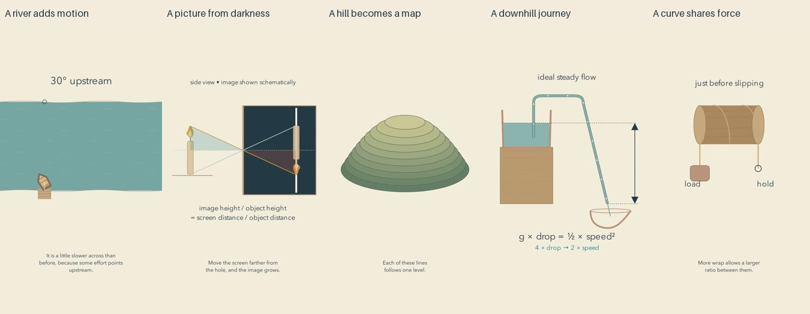

# Physical context: release and reflection

Cycle eleven of the autonomous run. All five final reviews were current before the first upload. Independent YouTube readback confirmed every release public and processed.

| Video | Duration |
| --- | --- |
| [The River Adds Its Own Journey #math #Shorts](https://www.youtube.com/shorts/WSN8jaN3giA) | PT1M7S |
| [A Little Darkness Makes a Picture #math #Shorts](https://www.youtube.com/shorts/x-MhKdt4qo4) | PT1M2S |
| [Reading a Hill Before Taking a Step #math #Shorts](https://www.youtube.com/shorts/kHmEPk65-VQ) | PT56S |
| [The Whole Journey Leads Downhill #math #Shorts](https://www.youtube.com/shorts/II21Ktrc2wE) | PT1M8S |
| [A Gentle Curve Shares a Force #math #Shorts](https://www.youtube.com/shorts/xDJAN2honaM) | PT1M15S |

[Editable projects](../examples/context) and [research](research/CONTEXT-AND-ABSTRACTION.md) document the hypothesis and its limits.

## What changed

A recognizable subject now carries the explanation: a boat crossing a river, a candle beside a dark chamber, a shaded hill, a siphon between vessels, and rope around a wooden post. The mathematical representation explicitly connects to those subjects. A river comparison prototype was inspected before extending the approach to five films. Native vector artwork keeps geometry editable and incurs no image-generation or stock-media fees.

The hill preserves its level rings while the view turns into a map. The camera keeps the same aperture as rays and similar triangles appear. The river shares one model clock between current and boat motion. Each episode changes a physical condition or location after explaining the relationship. This is an editorial composition, not evidence that one representational sequence always teaches better.

## Repairs before release

The camera's ratio was too small; splitting it into two lines and fitting it within the frame made it legible in the sampled final images. Two contour movements were shortened to fit their speech cues. The rope subject was enlarged and a second wrap introduced before its graph. The siphon needed a controlled tube path instead of a spline that overshot its endpoint; its outlet jet now starts tangent to the tube and curves under gravity. Flow markers use cached arc-length data and interpolation. A comparison label overlapped a three-line caption and was moved before release.

## Editorial reflection

The boat's visible miss gives a reason to care about vector addition. The candle's inversion is easy to identify before the ratios arrive. The hill-to-map transition is the most coherent representation change in this batch. These observations support keeping recognizable subjects and preserving their connection to diagrams.

The work is still closer to illustrated explanation than a fully realized contemplative film. The rope opening holds a static setup for too long; its graph conveys a result without fully exposing local force balance. The siphon has a convincing continuous path but tiny markers. The camera's long ratio sentence and the gradient's tangent language may still burden newcomers. Several passages name relationships while almost nothing changes visually. Warm color and slow narration do not automatically make an experience peaceful or inspiring.

The next experiment should give selected acoustic subjects a real, speech-free listening moment, while preserving an equivalent visible relationship for muted viewing. The earlier beats episode already demonstrated local tone generation; reusable, explicit sound mappings should replace one-off scoring scripts. Unrelated background music is not required. Aesthetic listening and audience response remain necessary limits on any quality claim.

## Evidence and limits

All 42 current final sheets were actually inspected: timeline contacts, opening motion, every cue page, all declared critical intervals and ending sheets. Inspection records bind to final export hashes. 

Independent calculations check the governing relationships and stated model conditions. All complete narration transcriptions were read; differences were number formatting. Inserted silence samples, surrounding low-energy intervals, source clipping and the decoded final mix were checked.

This is sampled image and signal/transcript review, not uninterrupted audiovisual watching or subjective listening. There are no measured results for recognition, calmness, enjoyment, learning, retention or reduced mathematics anxiety. Publication counts and passing checks do not establish artistic progress. No claim of a universal optimum or established quality plateau is made. Known-value privacy scans cannot exclude every unknown secret.
