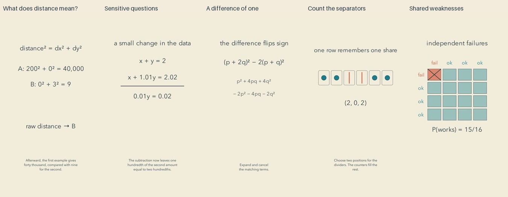

# Controlled contrasts: release and reflection

Cycle seventeen. All five scoped final reviews preceded the first upload. Independent YouTube readback confirmed all five public and processed.

| Video | Duration |
| --- | --- |
| [A Different Unit Can Change the Nearest Neighbor #math #Shorts](https://www.youtube.com/shorts/UKhMMdSx4IQ) | PT1M46S |
| [When a Tiny Measurement Change Moves the Answer #math #Shorts](https://www.youtube.com/shorts/1PJeOCcu5SI) | PT1M41S |
| [Fractions Guided by a Difference of One #math #Shorts](https://www.youtube.com/shorts/50H93LmK0rk) | PT1M40S |
| [Four Counters, Three Jars, Fifteen Possibilities #math #Shorts](https://www.youtube.com/shorts/K99XNd2h1wc) | PT1M39S |
| [When Two Backups Share One Weakness #math #Shorts](https://www.youtube.com/shorts/IELpiDlj6xg) | PT1M31S |

[Editable projects](../examples/contrasts) include the original scenes, narration and mathematical checks. [Research](research/CONTRAST-WITHOUT-OVERLOAD.md) distinguishes adjacent comparison-learning evidence from this production experiment.

## What the comparison earns

The machine-learning example holds the observations fixed while changing a unit, then restores the comparison with consistent reference scales. The conditioning example changes a measured total by one hundredth and compares two systems with very different answer sensitivity. The number-theory film derives an exact sign-flipping identity before using it to control an approximation. The counting film changes the empty-jar rule. The reliability film preserves individual failure probabilities while changing their dependence.

These are different mathematical questions and reasoning methods, rather than five variations on a moving curve. The mechanism index now includes 95 authored examples. Comparison against available learning goals and historical titles supports the selected distinctions; missing historical transcripts still limit an exhaustive novelty claim.

## Repairs and reusable knowledge

Literal cue preflight now detects every missing or repeated cue before synthesis. Narration was refined where two spoken numbers could resemble a single number, and current complete independent transcripts were read. An outline opacity change that filled jars was repaired using stroke opacity. The recurrence updates its displayed old pair consistently. Two openings now show relevant objects before introducing the algebra.

Final inspection caught a raw-distance result left visible under converted coordinates. The new export hides the old decision during conversion and during the return to before-conversion arithmetic. The installed knowledge source now includes a [transition-consistency repair](../plugins/mathtuber/skills/mathtuber/references/transition-consistency.md), alongside navigation, searchable repair notes and executed Manim primitives. These aids have not been evaluated with an independent lower-capability model.

## Viewer-perspective reflection

The jar film offers the most accessible action: move a separator and see an empty jar encoded. Its second rule gives the ending a fresh mathematical consequence. The backup comparison also has a tangible reason to care, with one changed assumption visibly changing the count of failures.

The scaling film asks a useful machine-learning question, but a viewer must distinguish coordinate numbers from screen distances. The annotation makes that distinction explicit; it still costs attention. The conditioning film has exact arithmetic and a strong sensitivity contrast, yet its nearly coincident lines are difficult to distinguish on a phone. The approximation film earns its identity through expansion, but assumes comfort with binomial algebra. A novice could lose the thread there.

The visual language is coherent and restrained. It is still closer to a careful illustrated explanation than the imaginative, artistic experience we want. Several endings settle into static formulas for too long. As an editorial prediction, the separator and shared-failure changes give a casual viewer clearer reasons to remain than a long algebraic passage. This is not measured retention, enjoyment, learning or subscription evidence.

The next experiment should carry an answerable action through the ending: let a viewer try one changed case with the same objects, then show its consequence. Reduce simultaneous symbols where they do not contribute to the inference. Keep the mathematical content substantial; more scenery, louder sound or a longer runtime would not by themselves resolve these weaknesses.

## Verification limits

All 70 current final contact-sheet pages were actually inspected: distributed frames, opening samples, every cue, three declared intervals and endings. All five full source transcripts were read against the intended narration. Full source and final audio signal measurements found no clipped samples; complete final media decoded. Independent exact computations and explicit general arguments accompany the examples. Public manifests validated, and the 128-test suite passed for the supporting tooling. Targeted secret and PII scans precede publication of repository changes.

This is sampled visual inspection and source transcription with final signal analysis, not continuous audiovisual playback or subjective listening. Final audio was not independently transcribed. Prosody, audience comprehension and aesthetic response remain unmeasured. There is still room for substantive improvement; this batch does not establish a quality plateau.
