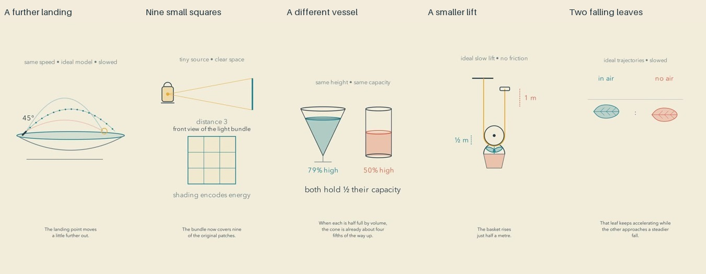

# Meaningful endings: release and reflection

Cycle seven of the autonomous run. All five final exports passed the batch gate before upload. Independent YouTube readback verified public visibility and successful processing.

| Video | Duration |
| --- | --- |
| [Two Arches and One Quiet Landing](https://www.youtube.com/shorts/7tnatS_WvrE) | PT1M16S |
| [The Light Shared Between Nine Small Squares](https://www.youtube.com/shorts/E4RL4OdFteQ) | PT1M15S |
| [A Steady Pour and an Unsteady Rise](https://www.youtube.com/shorts/v9DWYzRrgQE) | PT1M17S |
| [The Longer Journey That Makes a Basket Lighter](https://www.youtube.com/shorts/4Kr62L9pve4) | PT1M8S |
| [The Invisible Balance in a Falling Leaf](https://www.youtube.com/shorts/8P7c_XUNYWs) | PT1M11S |

[Editable sources](../examples/endings) accompany [research on endings and curiosity](research/ENDINGS-AND-CURIOSITY.md). The ending evidence tool, source batch and video-stream timing repair passed GitHub checks at bad46eb, 1a346ba and 0fea49d.

## What changed

Each film resolves one relationship, changes a condition, and shows the consequence near its ending. The fountain turns to forty-five degrees and reaches farther. The lantern moves to three distances and shares its modeled light among nine squares before coming close again. Equal inflow fills a cone and an equal-capacity cylinder to different heights. A smaller pulley lift keeps the same distance bargain. Two leaves continue falling with and without modeled drag.

These are editorial experiments inspired by research, not experimentally established improvements in Shorts retention or learning. A narrator showing an answer is different from a learner generating one. We have not measured either curiosity or transfer in viewers.

## Repairs before release

The fountain's range markers moved below its basin, an obsolete equal-distance label disappears, and initial velocity components now match the launch angle. The lantern distinguishes side and front views and identifies shading as energy encoding rather than perceived brightness. The cone's opening pour now follows a continuous clock; its final comparison was shortened to fit the spoken cue. The pulley anchor gap was closed and ambiguous cue phrases expanded. The leaf's stationary explanation is labeled as a force diagram, and its final trajectories share a continuous slowed clock.

A final-frame extraction failed because one container's audio tail extended beyond its video. The sampler now uses video frame count and frame rate when available. The repaired vessel sample shows the actual last frame at 76.0 seconds. This caught a review-tool defect without altering the media.

## Reflection as an editor

The fountain and falling-leaf endings offer the strongest continuing visual consequence in sampled evidence. The cone comparison gives a tangible second view of its relationship. The lantern's nine cells make its numerical consequence inspectable. The pulley repeats a useful ratio with a smaller movement, although its ending returns to a static hold.

The artistic ambition is still only partly met. Objects are generally clean icons on paper rather than richly observed things. The lantern is small; its two views require mental mapping. The leaf spends much of its middle as a static force diagram. Several formulas rely on familiar notation. The work is coherent, but its visual staging can feel diagrammatic and distant.

The next experiment should bring the relevant object or relationship closer, preserve its identity while changing view, and attach explanatory marks to what they describe. More decoration alone would not address these weaknesses. Research should distinguish attention guidance from comprehension and aesthetic preference. There is no demonstrated quality plateau.

## Evidence and limits

All forty-four final sheets were actually inspected: contact and opening-motion sheets, every cue page, three critical-interval sheets, and nine samples of each film's last fifteen seconds. Inspection records bind to current export hashes. Independent mathematics checks cover projectile range, inverse-square spreading, conical and cylindrical volume, rope-length conservation, and quadratic-drag trajectories.

Full independent ASR was read for all five. Two apparent repetitions in the pulley transcript did not recur in focused checks of the same audio. Other differences were spelling, number formatting and homophones. All final audio decoded without clipping. Four authored paragraph gaps per film were checked against inserted samples; measured full low-energy gaps were 1.25–1.35 seconds.

This review did not include uninterrupted audiovisual watching or subjective listening. Sampled images, transcription and signal checks do not establish natural prosody, perceived peace, enjoyment, learning, retention or reduced math anxiety. Privacy scanning checks known values and patterns; it cannot prove the absence of every unknown secret.
