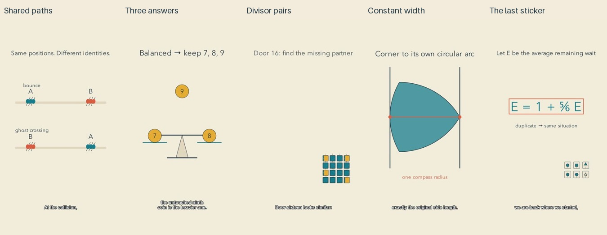

# Events batch: release and reflection

All five films passed the whole-batch release gate before the first upload. YouTube readback confirmed public visibility and successful processing for each one. This is cycle one of the autonomous improvement run.

| Video | Duration |
| --- | --- |
| [Can Collisions Slow These Ants Down?](https://www.youtube.com/shorts/U6YIZcin5zo) | PT1M21S |
| [A Balance Has Three Ways to Answer](https://www.youtube.com/shorts/LJiUsMsiaUI) | PT1M22S |
| [Why Only Square Numbered Doors Stay Open](https://www.youtube.com/shorts/PA5kHNSXjj4) | PT1M28S |
| [A Quiet Shape That Keeps the Same Width](https://www.youtube.com/shorts/VpID5nMCCIQ) | PT1M26S |
| [Why the Last Sticker Takes So Long](https://www.youtube.com/shorts/BrwK4slUC_M) | PT1M29S |

[Editable sources](../examples/events), [research](research/EVENTS-AND-PREDICTIONS.md), and [channel direction](CHANNEL-DIRECTION.md) accompany this release. Animation, narration and action sounds were generated locally. The production engine used no paid reasoning or speech API; host subscription, hardware, electricity and agent time are not included in that statement.

## Editorial judgment

The constant-width film is the closest to the desired channel: a quiet observation, a large continuous shape, and an explanation arising from its construction. The ant film has a clear identity exchange, but its schematic bodies and two-track model still feel like a puzzle. The balance episode remains the most classroom-like, spending its opening on rules. The locker grid becomes a physical pattern, although door twelve should visibly toggle through its factor visits in the close-up. The sticker album has a familiar emotional starting point, but its transition to a completed recurrence asks the novice to make too large a leap.

The main improvement is that actions now expose the argument: letter and color badges exchange; moving ants disappear at their exit times; a balance shows three outcomes; open doors change shape; fixed rails frame a turning constant-width curve. These are observable production changes, not measured gains in learning or retention.

## Repairs and remaining weaknesses

Final inspection caught crowded ant labels, ambiguous starting dots, a heading/inset collision, a sticker recoloring artifact, and captions that broke number lists into isolated flashes. Repairs used point markers with a legend, a reserved inset position, fill-only recoloring, and authored caption sense units. Slower local narration gives these relationships more time.

The repairs came too late in production and caused avoidable renders and repeated inspection. The next cycle should settle composition and caption phrasing in prototypes before freezing final inputs. Captions still use generic outlined typography that does not share the channel's visual language. Some clause breaks are also awkward. Formula passages need to retain a physical process rather than merely display its conclusion. Adding decorative texture or constant music would not resolve these weaknesses.

## Evidence limits

Independent mathematical checks cover the stated examples and assumptions. The final exports were inspected through distributed frames, all authored cues, opening motion samples and each declared critical interval. Full source narration underwent independent ASR, and full final audio underwent signal decoding. No clipping was found. Number formatting and minor ASR differences were reviewed; a focused recheck did not reproduce an extra closing phrase hallucinated by the whole-pass coin transcription.

This was sampled visual inspection, not uninterrupted audiovisual viewing. Subjective listening, pleasing prosody, aesthetic preference, retention and learning were not measured. The separate editorial records describe remaining weaknesses rather than assigning invented audience scores. The targeted public-tree and reachable-history credential/PII scan passed; it cannot prove absence of arbitrary unknown secrets.

## Next cycle

Meaningful improvements remain possible, so this is not a stopping point. Test whether one continuous mathematical setting can carry observation, mechanism and reflection with fewer abstract resets. Make caption typography part of the pinned channel profile and allow explicit line boundaries. Explore mathematical mechanisms in nature and art, while keeping idealizations visible and avoiding unsupported claims about peace, therapy or life optimization.
