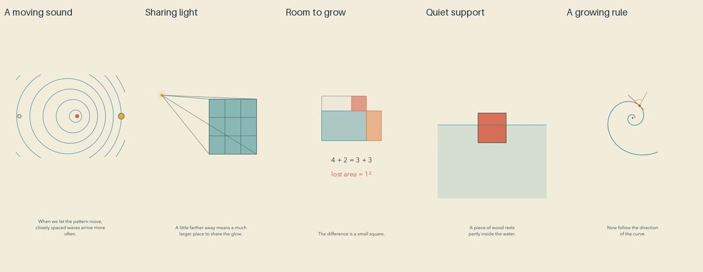

# Flow batch: release and reflection

Cycle five of the autonomous run. All five current final exports passed the whole-batch gate before upload; independent YouTube readback verified public visibility and successful processing.

| Video | Duration |
| --- | --- |
| [The Uneven Rings Left by a Moving Sound](https://www.youtube.com/shorts/yKoOkt2azfY) | PT1M16S |
| [Why Distance Spreads a Little Light So Thin](https://www.youtube.com/shorts/6Y0WM4ao02Q) | PT1M14S |
| [The Garden Hidden Inside the Same Fence](https://www.youtube.com/shorts/zpCHLHDucrM) | PT1M11S |
| [The Water That Quietly Holds a Piece of Wood](https://www.youtube.com/shorts/XSX0sjEVnQw) | PT1M21S |
| [A Spiral That Grows Without Forgetting Its Shape](https://www.youtube.com/shorts/0reqEqp9AO4) | PT1M19S |

[Editable sources](../examples/flow) and [process/inspection research](research/PROCESS-AND-INSPECTION.md) accompany the release. The sources and engine change passed GitHub checks. Speech and rendering ran locally; hardware, subscription and agent time still have costs.

## What improved

A process clock now keeps its phase across narration beats, labels and waits. Explicit inspection pauses preserve that phase. A real Manim integration test caught a missing frame at animation boundaries in the initial accumulator; reading absolute renderer time resolved it. Seventy-five unit tests and an actual four-second render passed.

The sound film keeps wavefronts centered where they were emitted and adds fixed listeners that respond to arriving fronts. Its pause for a distance comparison is explicit. The light film keeps subdivisions on the original enlarged patch; an earlier separate inset was removed after preview inspection. The garden's matching strip moves into the gained region, leaving the missing square attached to the original construction. The buoyancy film replaces a block with a parcel of water at the same boundary. The spiral's opening was shortened and its radial examples enlarged.

Inserted paragraph silence is 0.45 seconds. Measured full low-energy gaps, including surrounding synthesis silence, are 1.25–1.35 seconds. These values are creative tests, not research-established optima. Continuous movement is reserved for relationships where it helps; comparisons can hold still.

## A viewer's likely experience, with limits

The garden has the most compact mathematical payoff: imbalance removes a square of area. The buoyancy replacement keeps a difficult counterfactual in one place. The spiral has an elegant scale-and-turn ending, while the waves give an immediate pattern to notice. Those are editorial impressions from inspected captioned image sequences, not human audience observations.

The videos remain more diagrammatic than the intended artistic experience. A garden is a rectangle, wood is a coral block, and a lamp is a dot. The abstraction protects exact relationships but gives a casual viewer few familiar visual anchors. The sound film explains pitch without letting the viewer hear the change. The spiral's tangent can still need a closer view. The garden's half-unit case displays the leftover square without replaying the matching move. In the light film, color marks a bundle, not a measured brightness field.

The next experiment should make selected objects recognizable while preserving their mathematical identity, then remove irrelevant details as the explanation becomes general. Sound should demonstrate an audible relationship when it is the subject, with dedicated listening space and a visual explanation that also works muted. Neither more decoration nor a universal background track follows from these observations. Research must distinguish recognition, enjoyment, task performance and transfer. There is no demonstrated quality plateau yet.

## Review evidence

All 39 current final sheets were actually inspected: five contact sheets, five opening-motion sheets, all cue pages and fifteen critical-interval sheets. Evidence and inspection records are bound to export hashes. Independent mathematical checks cover wavefront spacing, ray-bundle area scaling, fixed-perimeter optimization, hydrostatic buoyancy and logarithmic-spiral geometry.

All narration was independently transcribed; focused ASR recovered words omitted by full-file transcription in the sound and buoyancy endings. A focused spiral check did not reproduce the full-file repeated word “curve.” Number formatting and minor phonetic differences remain documented; no mathematical content change was identified. All final audio decoded without clipping, and all four authored pauses per film were verified against zero samples.

This does not include uninterrupted audiovisual viewing or subjective listening. It cannot establish natural prosody, peace, engagement, learning, reduced anxiety or follow-through. No audience retention or learning results are available. The repository and reachable history received a targeted credential/PII scan; that is not proof against every possible unknown secret.
