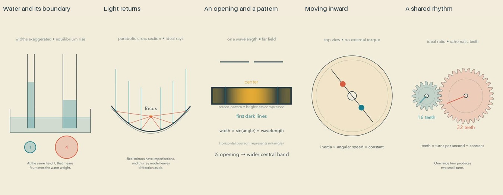

# Focal staging: release and reflection

Cycle eight of the autonomous run. The whole batch passed its review gate before uploading. Independent YouTube readback confirmed all five public and processed.

| Video | Duration |
| --- | --- |
| [The Small Edge That Helps Water Climb #math #Shorts](https://www.youtube.com/shorts/OVM8iROHfKk) | PT1M8S |
| [A Bowl of Light and Its Return Journey #math #Shorts](https://www.youtube.com/shorts/BgPW1qRgnjE) | PT1M10S |
| [The Narrow Opening That Lets Light Spread #math #Shorts](https://www.youtube.com/shorts/HzLfRRU7Tco) | PT1M11S |
| [The Quiet Rhythm of Moving Inward #math #Shorts](https://www.youtube.com/shorts/Q47PTJIiLtY) | PT1M12S |
| [Two Circles Sharing a Mechanical Rhythm #math #Shorts](https://www.youtube.com/shorts/UG0ry083oaA) | PT1M5S |

[Editable projects](../examples/focal) and [primary research](research/FOCAL-STAGING.md) document the experiment. The framing helper passed unit tests and a rendered integration check; source repairs passed GitHub checks.

## What changed

A relevant subject moves closer while captions stay fixed. The same water reservoir, mirror, slit, rotating platform or gear pair remains identifiable. Geometry preserves its aspect ratio. Active physics updaters must be deliberately paused and rebuilt around the new coordinates; the helper rejects silent transformations of live simulations.

The mathematical content covers capillary equilibrium, parabolic reflection and reversal, single-slit diffraction, conservation of angular momentum, and gear ratios. These are five different mechanisms, not five reskins of one proof.

## Repairs found in review

Capillary area values were shortened to fit inside their circles. The mirror's moving reflection point follows the parabola throughout its journey; focus labels avoid crossing rays. The diffraction pattern received a dark screen so its minima look dark rather than like unpainted paper. Its changing pattern preserves the fitted screen geometry. The rotating platform integrates angular speed continuously as its weights move. Gear markings preserve the opposite-direction ratio, with schematic tooth geometry explicitly identified.

## Editorial reflection

The gear pair offers the clearest immediate physical rhythm. The mirror gives a satisfying reversal, and the capillary comparison makes a counterintuitive scale relationship concrete. The diffraction film benefits strongly from the screen correction but still asks viewers to map an aperture to a separate pattern. The spinning weights show a continuous consequence, although the actuator remains outside the model.

Closer staging improves inspectability in these sampled frames. It does not by itself make the work richly artistic. Much of each middle remains a static explanation, objects resemble diagrams more than observed materials, and some small scope labels demand attention. The persistent paper palette is coherent but can become repetitive. These are plausible editorial weaknesses, not measured viewer responses.

The next research question is how to give objects material presence while preserving explanatory simplicity. Depth, light, surface and physical context should communicate something about the subject. A decorative background cannot substitute for a visible mechanism. Any added realism must leave the causal relation easy to follow. There is no demonstrated quality plateau, and publication count is not evidence of improvement.

## Evidence and limits

All 46 current final sheets were actually inspected: distributed contacts, opening motion, all cue pages, declared critical intervals, and the complete ending sheets. Export hashes bind the inspection records to the reviewed media. 

Independent numerical checks cover the five stated mathematical models, including ray reflection and continuous angular phase. All full ASR transcripts were read; focused checks recovered two apparent omitted words and did not reproduce one apparent gear-word duplication. Final audio decoded without clipping. All four inserted paragraph gaps per film were verified against PCM samples.

This is sampled image inspection and signal/transcript review, not uninterrupted audiovisual watching or subjective listening. We have not measured enjoyment, natural prosody, peacefulness, learning, recognition, retention or reduced fear of mathematics. Research about attention does not establish these outcomes. Known-value and pattern privacy scans cannot prove the absence of every unknown secret.
