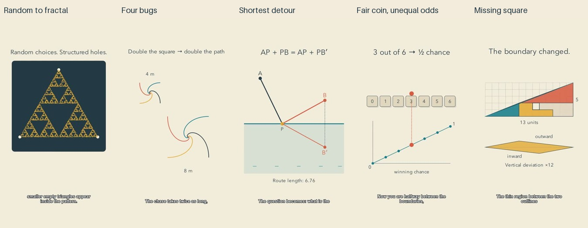

# Linked-representation batch: release and reflection

Five new Shorts were reviewed as a complete batch before publication, then read back from YouTube as public and successfully processed. Production used local Manim and Kokoro, with host-agent research and authorship. No paid reasoning or speech API was used by the production engine; host subscription, hardware and electricity are not free and are not costed here.

| Video | Duration | Final render pass |
| --- | --- | --- |
| [Random Dots Can Draw a Fractal](https://www.youtube.com/shorts/PDwLNxlOyEE) | 1:22 | 94.8s |
| [Four Bugs Chase Each Other. How Far Do They Go?](https://www.youtube.com/shorts/PbSQO5r41bs) | 1:22 | 56.3s |
| [The Shortest Detour Is a Straight Line in Disguise](https://www.youtube.com/shorts/TM8UOK7zEoA) | 1:17 | 67.2s |
| [A Fair Coin Does Not Mean a 50–50 Finish](https://www.youtube.com/shorts/NeszFObfYEw) | 1:20 | 40.9s |
| [Where Did This Extra Hole Come From?](https://www.youtube.com/shorts/tVGjxq004xg) | 1:22 | 85.2s |

The timings are recorded by the native renderer on this workstation; they exclude previews, repairs, synthesis, review, assembly and upload. They are not a controlled speed comparison. [Editable sources](../examples/linked) include the pinned profile, timing, review plans and independent mathematical checks. [Research supplement](research/LINKED-REPRESENTATIONS.md) distinguishes empirical findings, frameworks and design hypotheses.

## What improved

The strongest change is the bridge between representations. One bank point drives both routes and their length; one token position stays aligned with its probability height; the dissection retains exact pieces while a labeled inset exposes the boundary change. The chaos-game episode connects a moving midpoint to a region map and tests the explanation with a square. The pursuit episode connects a curved path to a simple shrinking gap. These are inspectable design changes, not demonstrated improvements in viewer learning.

The dark plotting field and spiral traces add more visual variety than the last all-workbench batch. Whole phrases now fade cleanly rather than distorting glyphs. All critical intervals, including late transformations and endings, were sampled through completion. Preview review caught filled pursuit paths caused by a general opacity change; stroke-only opacity fixed them. Stale arrows on the probability board were removed before the starting position changed. The reflection opening was regenerated with explicit point names after an ambiguous ASR result.

## What still needs work

My editorial judgment is that the chaos game and missing-square opening offer the clearest immediate curiosity, while pursuit has the most distinctive linework. Reflection is the most concrete example of linked views. The fair game remains the most classroom-like: its averaging argument may require replay, and its opening shows a numbered board rather than a physical coin toss. The 13-by-5 dissection is still shallow in a portrait frame. Several inference passages remain visually still while narration develops the relationship; this is deliberate, but the duration has not been tested with viewers.

Channel identity is becoming a consistent visual language, not yet a proven recognizable brand. Topic-specific settings still use fairly schematic objects. More texture or music would not automatically fix that. Sound uses quiet original boundary tones and dry narration; full-signal decoding and independent ASR were checked, but pleasant prosody, subjective mix quality and continuous audiovisual experience were not evaluated by listening.

## Evidence and next experiment

All 51 unit tests passed; the skill validator passed; the targeted public-tree credential/PII scan found no matches. Each film has an independent mathematical derivation plus exact or numerical checks, current-export evidence, and a separate written release judgment. The record counts in [the report](linked-batch.json) describe sampled frames, not uninterrupted viewing. ASR differences include punctuation, number formatting and minor recognition variation; no mathematical number change was found.

The next useful experiment is viewer testing of one difficult mapping, not adding more stylistic rules. Compare a linked and an abruptly replaced view with matched narration; measure whether viewers can explain the relation and solve a changed case. Separately test appeal and channel recognition. YouTube retention around those transitions can diagnose exits, but topic selection and audience differences prevent a simple causal claim. No such audience test or retention improvement is reported for this release.
