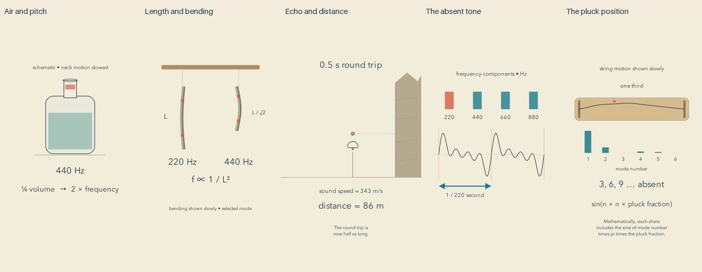

# Explanatory listening: release and reflection

Cycle twelve. All five current final reviews preceded the first upload. Independent YouTube readback confirmed public, processed releases.

| Video | Duration |
| --- | --- |
| [The Note Inside an Empty Space #math #Shorts](https://www.youtube.com/shorts/jO7aWiZ65kA) | PT1M16S |
| [A Small Cut Changes the Song #math #Shorts](https://www.youtube.com/shorts/2Qy7xWNTUN4) | PT1M15S |
| [A Distance Hidden in a Quiet Gap #math #Shorts](https://www.youtube.com/shorts/FDf78HitFWE) | PT1M7S |
| [The Pitch That Can Outlive Its Lowest Tone #math #Shorts](https://www.youtube.com/shorts/bdujDJYncac) | PT1M24S |
| [Where a Small Gesture Begins #math #Shorts](https://www.youtube.com/shorts/eump53cJ4ng) | PT1M12S |

[Editable projects](../examples/listening) and [research](research/EXPLANATORY-LISTENING.md) document the models and evidence boundaries.

## What changed

Sound now demonstrates a stated relationship inside measured speech pauses. A smaller air cavity raises a bottle's modeled resonance; a shorter beam raises a selected bending-mode frequency; an echo delay measures a round trip; a removed frequency component need not remove the perceived pitch; a changed pluck position changes harmonic weights. These are original synthesized demonstrations, not recordings of physical instruments or a field environment.

A reusable compiler resolves listening windows against measured narration pauses. It rejects overlaps with speech and action sounds, validates frequency/amplitude/fades, and creates deterministic local PCM. No model API, stock audio or image generation was needed. The visible comparison remains available for muted viewing.

## Repairs that mattered

The bottle's frequency initially failed to follow the changing air volume; its quarter-volume label also sat in the liquid. Both were corrected, and an adjacent larger/smaller reference replay added. The echo's spoken speed-of-sound sentence was rewritten after ambiguous transcription. Numeric shape morphing was replaced by fades to avoid intermediate glyph fragments.

The missing-fundamental replay exposed a more serious discrepancy: a direct tracker reset followed by an optimized static wait left the diagram in its previous state while the reference mixture played. An explicit animated reset repaired it. Final listening-window frames now show the restored 220 Hz bar during the reference and its absence during the comparison. This is why verifying a sound file or render completion alone is insufficient.

## Reflection from the inspected evidence

The strongest advance is giving viewers something to compare rather than only describing a relationship. Bottle and chime comparisons connect an ordinary object to an audible consequence. The echo turns a quiet interval into a measurable journey. These are editorial observations about the construction; they are not measured viewer responses.

The missing-fundamental film is still visually sparse and abstract. The pluck explanation may ask newcomers to infer too much about decomposition. Several endings hold a diagram while narration qualifies the model. Pure sustained tones demonstrate frequency cleanly but lack the texture of real materials. I cannot claim the mix is beautiful or the synthetic voice feels warm without subjective listening. Calm colors and deliberate pauses alone do not produce a compelling contemplative film.

The next experiment should make a relationship unfold through a continuous visible operation, with a stable comparison retained, rather than adding decorative movement to a static explanation. Motion should expose the reason a result holds. Complex patterns can be welcome if their organizing rule becomes easier to see. This remains an artistic hypothesis to prototype, not a universal prescription.

## Verification and limits

All 45 current final sheets were actually inspected, including timeline contacts, all cue pages, opening motion, critical intervals, endings and three frames per listening window. 

Independent mathematical checks, complete narration transcripts and focused rechecks were reviewed. Source PCM matches the analytic score within quantization tolerance, is silent outside scheduled windows, and stays inside measured pauses. Final AAC was decoded and expected tone components checked. All final review evidence binds to the current export hashes.

This is sampled image, transcript and signal review, not uninterrupted audiovisual watching or subjective listening. Retention, recognition, enjoyment, learning and reduced mathematics anxiety are unmeasured. Neither release counts nor passing checks establish artistic superiority. A plateau has not been established. Targeted privacy scans cannot rule out every unknown secret.
