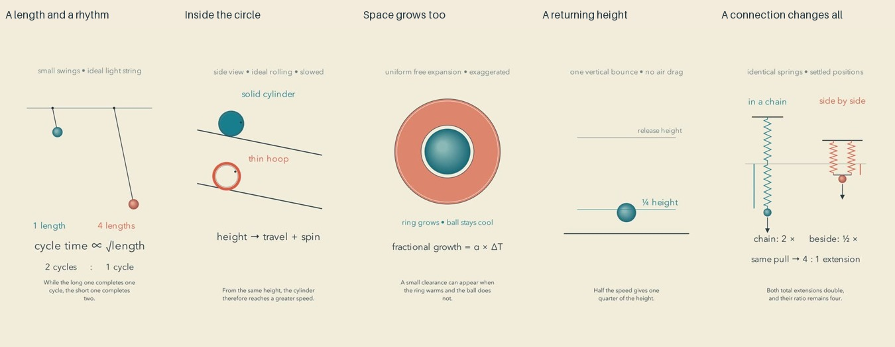

# Material presence: release and reflection

Cycle nine of the autonomous run. The whole batch passed its review gate before uploading. Independent YouTube readback confirmed all five public and processed.

| Video | Duration |
| --- | --- |
| [A Quiet Clock Hidden in a Length #math #Shorts](https://www.youtube.com/shorts/87HeataDcK0) | PT1M2S |
| [The Different Lives Inside Two Circles #math #Shorts](https://www.youtube.com/shorts/xihfIIeWXoE) | PT1M4S |
| [The Empty Space That Grows with a Ring #math #Shorts](https://www.youtube.com/shorts/5hcZywPMCc4) | PT1M5S |
| [The Square Hidden in a Returning Ball #math #Shorts](https://www.youtube.com/shorts/bzcIvYdrxlk) | PT1M4S |
| [The Quiet Difference Made by a Connection #math #Shorts](https://www.youtube.com/shorts/dUXbPq68l3Q) | PT1M |

[Editable projects](../examples/material) and [primary research](research/MATERIAL-PRESENCE.md) document this restrained style experiment.

## What changed

Soft, directionally consistent shading gives selected physical objects a little volume. Mathematical outlines and flat encodings remain legible. The helper is a painted visual cue, not a physical lighting model. It must not be used to change the perceived magnitude of quantitative dots or area comparisons. A rendered comparison and an integration check preceded adoption. The existing 83 unit tests passed.

The five subjects are pendulum length and period, rolling mass distribution, expansion of a hole, rebound height, and spring connections. Each has its own stated idealization and numerical checks.

## Repairs found before release

The pendulum's period scale now uses the same gravity across comparisons; labels were separated from its equation. The rolling cylinder received a flat face so it does not read as a sphere. Its mark rotates in the no-slip direction, its second release starts farther up the same ramp, and the hoop label clears the upper ramp. The thermal narration now says to compare the ball with the ring, matching the image. The bouncing ball was enlarged, and height markers now measure clearance from the floor to the ball's bottom rather than mixing center and surface heights. Spring pulls represent controlled forces and settled positions, not an unmodeled transient simulation.

## Editorial reflection

The ring gives the clearest conceptual reversal: a hole grows along with its surroundings. The pendulum keeps a continuous physical rhythm through much of its explanation. The bounce has an immediately recognizable event. Springs offer a clean comparison, although the objects are small. The rolling film retains a long static middle and asks narration to do too much of the energy explanation.

The restrained shading is pleasant in sampled frames and helps separate a ball from a symbolic dot. It is a modest aesthetic change. It does not make these films richly imaginative or establish better teaching. Most compositions still resemble diagrams on a page; the middle often gains labels while the underlying image stays almost unchanged. Quiet pacing becomes unproductive when the viewer has no new relationship to inspect.

The next experiment should expose a reasoning step through a visible transformation: preserve the relevant object, show what changes and what remains, and leave the result available for comparison. Extra motion alone is not the objective. This remains an editorial hypothesis; no quality plateau has been demonstrated.

## Evidence and limits

All 40 current final sheets were actually inspected: distributed contacts, opening motion, all cue pages, declared critical intervals, and complete ending sheets. Export hashes bind these records to reviewed media. 

Independent calculations cover all five mathematical models. Full ASR transcripts were read; three matched exactly, and the remaining discrepancies were compound-word or fraction formatting and one omitted conjunction without a change of meaning. Final audio decoded without clipping. Four inserted paragraph gaps per film were checked directly against PCM samples.

This is sampled image inspection and signal/transcript review, not uninterrupted audiovisual watching or subjective listening. Enjoyment, natural prosody, peacefulness, learning, retention and reduced fear of mathematics have not been measured. Publication count is not evidence of improvement. Known-value and pattern privacy scans cannot prove absence of every unknown secret.
