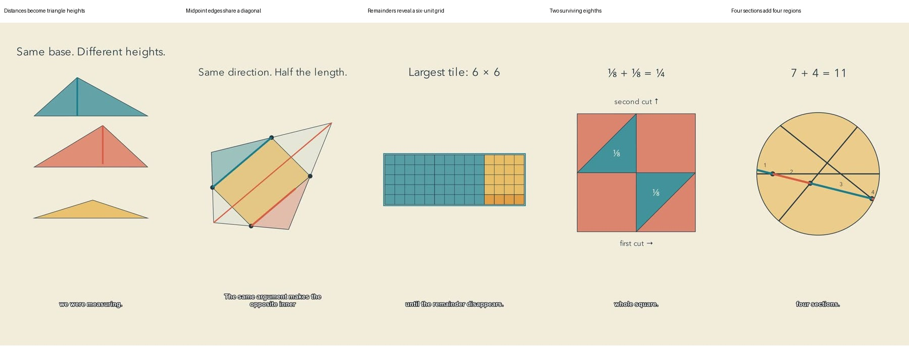

# Mechanism batch: release and reflection

Five new Shorts were reviewed as one batch before the first upload, then published to the connected channel. YouTube API checks confirmed public visibility and successful processing for every release. The two remade reference topics stayed local.

| Video | Duration | Status |
|---|---|---|
| [Move This Dot. The Total Never Changes. #math #Shorts](https://www.youtube.com/shorts/MkY8XgmBYg8) | 1m13s | Public; processed |
| [Hide a Parallelogram in Any Four-Sided Shape #math #Shorts](https://www.youtube.com/shorts/H1d4Og1D0dg) | 1m12s | Public; processed |
| [The Biggest Tile Is Hiding in the Leftovers #math #Shorts](https://www.youtube.com/shorts/CoLdfSfkXFc) | 1m14s | Public; processed |
| [Break a Stick Twice. Why Only One in Four Works? #math #Shorts](https://www.youtube.com/shorts/I5N23mV1KBs) | 1m18s | Public; processed |
| [Three Cuts Can Make Seven Pieces. What About Four? #math #Shorts](https://www.youtube.com/shorts/ROW9dm6Xr4k) | 1m10s | Public; processed |

## What improved

The strongest change is explanatory continuity. The moving midpoint shape, the changing distance bar, the squares removed from the same rectangle, and the extra region born when a pizza cut moves all expose an actual mathematical relationship. The profile now includes concrete reference images and anti-examples, also bundled inside the installable skill. It is more actionable than a palette plus adjectives.

Review also changed the released media. Adjacent-frame inspection caught Viviani pieces rotating off-screen; they now rotate individually around their centers inside the frame. Euclid’s lifted squares were separated. The successful broken-stick triangle received a longer visible hold. A caption repair prevents punctuation from starting a new caption. These corrections happened before publication.

## Editorial judgment

| Film | Strongest part | Remaining weakness |
|---|---|---|
| Viviani | The changing distances and fixed sum create an immediate visual question. Equal-base pieces make the area argument concrete. | The area inference still takes a long narrated hold. Matching each distance to its relocated height could be even more explicit. |
| Midpoints | Deformation and half-scale triangles reveal a real mechanism. The concave transfer case retains the setup. | The diagonal view becomes busy, and similarity remains a prerequisite that some viewers may not have. |
| Euclid | A complete, constructive answer: the leftover strip explains six, then the whole grid demonstrates it. | The opening is more like a classroom exercise. The long rectangle uses portrait space poorly. |
| Broken stick | Impossible cut pairs are removed until two eighths remain. The randomization rule is explicit. | The move from physical stick to coordinate square is the biggest abstraction jump. A live link between both representations would be better. |
| Pizza | Moving one line visibly creates a seventh region; tracing the blade explains why. | Still a clean geometric disk rather than a distinctive physical world. The fifth-cut transfer is stated, not animated. |

My strongest candidates for an accessible opening are pizza and midpoints. This is an editorial judgment, not evidence that viewers actually stayed. Euclid is the clearest candidate for improving surprise and composition. Across the batch, some proof passages still sit on a finished diagram while the voice explains it. The work is clearer, but it has not yet earned a claim of exceptional entertainment or instantly recognizable channel identity.

## Next priorities

1. Link representations continuously at abstraction jumps: a cut moves on the stick while the corresponding point moves in the probability square; a height travels from its triangle into the total bar.
2. Use topic-specific composition and material detail while keeping the channel’s color, type and motion decisions consistent. A stronger identity needs more than the same background.
3. Replace long explanatory holds with one meaningful action at the moment of inference. Do not add motion merely to keep the screen busy. Replace brief morphing text labels with simpler fades for better transitional legibility.
4. Test voice, pauses and boundary sounds through actual listening. Then use a small real-viewer test to separate enjoyment, comprehension and channel recognition. Retention graphs can locate drop-offs but cannot alone establish their cause.

## Evidence and limits

Each final export passed mathematical review, measured-cue overrun checks and media verification. Image inspection covered 12 distributed captioned frames, a sample at every authored cue and 16 adjacent motion samples per film; Viviani additionally had 16 samples across its full repaired rotation passage. Complete audio was decoded, source signals checked, and narration independently transcribed with faster-whisper. Minor ASR formatting/function-word differences were reviewed. In pizza, ASR omitted one redundant “five”; the adjacent sentence and visible +5 state the intended count. No mathematical contradiction was identified.

This host did not perform uninterrupted audiovisual viewing or subjective listening. No real viewers, retention gains, learning gains, recognition results or subscriber effects are claimed. The viewer-test protocol is documented, but not performed. Workshop 0.2 remains a candidate profile.

All 48 engine tests pass, including later-member batch blocking, stale editorial evidence and caption punctuation. Independent checks cover the five mathematical mechanisms. The publication log verifies that all five current reviews existed before the first upload.

## Reproduction and cost

Editable sources, manifests, pinned profiles, timing data and mathematical arguments are in [examples/mechanisms](../examples/mechanisms). The `score.py` helper reproduces original quiet boundary tones; proof passages have no music bed. Kokoro speech, Manim animation, FFmpeg assembly and Whisper transcription ran locally. No paid reasoning or speech API was called by the engine. Host subscription usage and machine costs are not measured, so this is not a claim of zero total cost. Per-export final render and assembly wall times are recorded in [the release JSON](mechanism-batch.json); they exclude research, authoring, earlier renders, review and upload. No controlled speed comparison was performed.

Credentials, production databases and upload receipts stay outside Git. A targeted scan checked known credentials, personal paths/email, private channel ID and token patterns; no matches were found in the public candidate tree. This scan is not a proof that arbitrary unknown secrets cannot exist.
