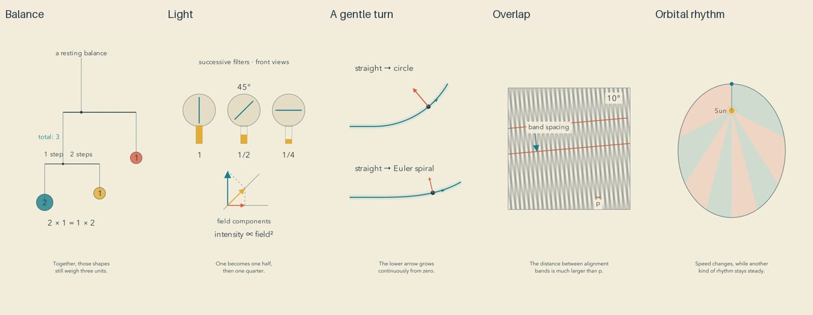

# Motion batch: release and reflection

Cycle three of the autonomous run. All five films passed the whole-batch gate before upload. YouTube readback verified public visibility and successful processing.

| Video | Duration |
| --- | --- |
| [The Quiet Mathematics of a Balanced Mobile](https://www.youtube.com/shorts/DPxiXHUnILI) | PT1M20S |
| [How a Third Filter Lets Light Through](https://www.youtube.com/shorts/xtLhBW1Bblo) | PT1M37S |
| [The Curve That Lets a Turn Arrive Gently](https://www.youtube.com/shorts/dI9yY67NFbE) | PT1M28S |
| [A Larger Pattern Hidden Between Two Sheets](https://www.youtube.com/shorts/G9qlxO7_KYk) | PT1M26S |
| [The Even Rhythm Inside an Uneven Orbit](https://www.youtube.com/shorts/QjmBc877DZg) | PT1M33S |

[Editable sources](../examples/motion), [research](research/ATTENTION-AND-INFERENCE.md), and [captioned preview implementation](CAPTIONED-PREVIEWS.md) accompany this release. All narration and rendering ran locally. Hardware, subscriptions and agent time still have costs.

## Production improvement

Captioned prototypes now share the final caption generator, phrasing and profile style. They are cached review artifacts and cannot stand in for accepted exports. Faithful outline emphasis preserves glyphs and mathematical geometry. YouTube publication briefly retries visibility readback and retains existing video IDs when visibility is still pending.

The implementation passed 66 unit tests, the skill validator, and a real captioned-preview integration check. The five independent mathematical checks cover torque and center of mass, sequential projections, integrated curvature, grating phase geometry, and Kepler area rates. Assumptions and numerical tolerances travel with the examples.

## Viewer-oriented judgment

The subject shapes the composition more than in the previous batch. The mobile becomes a sculpture assembled branch by branch. The orbit's colored sectors create its most satisfying visual payoff. The two tracks make a useful simultaneous comparison. These are editorial impressions from inspected images and sequences, not measured viewer reactions.

There is still too much explanation spoken over a settled diagram. In particular, the orbit introduces angular momentum faster than a novice can build intuition for it. The polarizers require the viewer to integrate separate filters and a lower field diagram. The moire effect is immediately visible, but dense stripes are less peaceful than the intended channel style; its exact half-angle equation is stated rather than derived. The mobile is gentle but could gain from showing what an imbalance actually does. The track's final caveats create a long visual hold.

The channel is becoming more consistent, but warm paper and a slower voice alone do not create an artistic experience. Meaningful improvements remain. The next experiment should give the eye time after a decisive change, carry one object through the inference, and let the ending reveal something expressive rather than simply restating a result. This does not justify longer empty holds or universal rules about seconds.

## Repairs and limits

Early inspection caught cue ambiguity and animation overruns. Review removed a stale numerical label while gratings rotated and moved a formula away from a three-line subtitle. Rebuilt final exports received new evidence before acceptance. Opposing torque arcs were added without distorting the mobile's geometry.

The current final review covers twelve distributed frames, every authored cue, eight opening samples and nine samples in each of three critical intervals per film. Full narration underwent independent ASR and the complete final audio was decoded without clipping. Focused transcription recovered words omitted by full-file ASR, including a mathematical quantity; reports preserve both results.

This is sampled image review, not uninterrupted audiovisual viewing or subjective listening. No claims are made about pleasing prosody, retention, actual learning, channel recognition or reduced math anxiety. Dry narration remains intentional. The public files and reachable history received a targeted credential/PII scan; that scan cannot prove the absence of every unknown secret.
