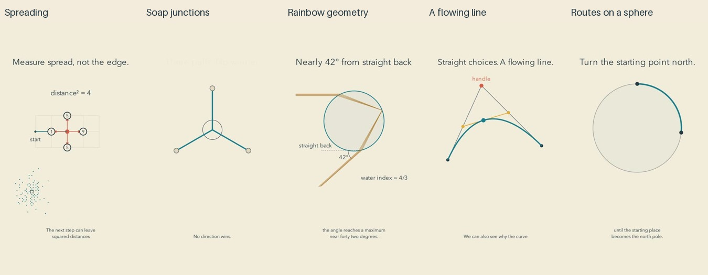

# Nature batch: release and reflection

Cycle two of the autonomous improvement run. All five final reviews passed the whole-batch release gate before upload. YouTube readback verified public visibility and successful processing for all five.

| Video | Duration |
| --- | --- |
| [The Quiet Rhythm of Spreading](https://www.youtube.com/shorts/txC2R1d3_cI) | PT1M32S |
| [Why Soap Films Meet at 120 Degrees](https://www.youtube.com/shorts/emdyPrpKHlI) | PT1M35S |
| [The Geometry That Gathers a Rainbow](https://www.youtube.com/shorts/g2POd_ScOSA) | PT1M33S |
| [A Curve Made from Straight-Line Choices](https://www.youtube.com/shorts/CVIKlfBhzAw) | PT1M33S |
| [When the Shortest Route Looks Curved](https://www.youtube.com/shorts/pGVzJf5iR3M) | PT1M39S |

[Editable sources](../examples/nature), [caption implementation](CAPTION-STYLES.md), [research](research/CONTEMPLATIVE-SETTINGS.md), and [channel direction](CHANNEL-DIRECTION.md) accompany this release. Narration and animation were produced locally. This does not make host subscriptions, hardware or agent time free.

## What improved

Captions now inherit the pinned channel profile: quieter typography, dark ink on warm paper, and authored phrase boundaries. The Bézier construction makes a continuous line from repeated choices. The soap film links a closed force triangle to a balanced junction. Rainbow rays use a checked refraction model and an actual backscatter reference. The globe preserves the same sampled routes across representations and rotates them in three dimensions.

These changes make the visual language more coherent in the inspected samples. They are production observations, not measured improvements in attention, affection for mathematics or learning.

## Viewer-oriented judgment

The Bézier film comes closest to the artistic direction because its motion creates the object it explains. It still ends as a diagram; a finished expressive drawing could provide a stronger emotional return. The diffusion opening feels gentle, but the move into squared-distance arithmetic asks a novice to make a large conceptual jump. Soap is tangible in its geometry, yet the 60-to-120-degree inference deserves a continuous angle demonstration. The rainbow has a strong natural subject, but neighboring rays merge visually and their concentration remains partly asserted. The globe gives a useful change of viewpoint, although the final minimal-path argument relies too much on narration.

The repeated heading/diagram/caption arrangement remains too dominant. Spaciousness helps only when the empty area gives the eye somewhere purposeful to rest. Here it sometimes leaves a small mechanism isolated in a large page. Several holds need a more visible relationship, not decorative movement. No invented viewer scores are assigned.

## Repairs caught by final review

Default emphasis briefly recolored numerals and distorted exact shapes; clay outlines and stroke-only changes replaced those cues. The Bézier narration originally said every choice collapsed at an endpoint, although an intermediate point remains elsewhere; it now correctly refers to the final point. A rotating globe marker was cached as static while the route moved; grouping all changing objects into the same animation repaired that temporary disconnect. Changed exports were rebuilt and their evidence regenerated before acceptance.

These late repairs cost avoidable renders. The next production cycle should inspect mathematical language against every intermediate construction state and inspect the midpoint of each linked-object animation in a captioned prototype.

## Review scope

Independent exact or numerical mathematical checks passed. Each current final export was inspected through distributed frames, every authored cue, opening motion samples and three critical intervals. Full narration underwent independent ASR and full final audio underwent signal decoding. No clipping was detected. Minor transcription differences were inspected without treating similarity scores as proof of correctness.

This was sampled image inspection, not uninterrupted audiovisual viewing. Subjective listening, prosody, aesthetic preference, viewer retention and learning were not measured. Dry narration was intentional; adding music remains a design question requiring perceptual review. The targeted public-tree and reachable-history credential/PII scan passed, with its normal limitation: it cannot identify every possible unknown secret.

## Next cycle

Meaningful improvements remain, so the run continues. Develop compositions around the physical process rather than a persistent heading. Put short explanatory labels near their objects, preserve identity through transformations, and expose the difficult inference with a visible comparison. Keep attention cues geometrically faithful. Evaluate those changes separately from claims about learning or audience response.
