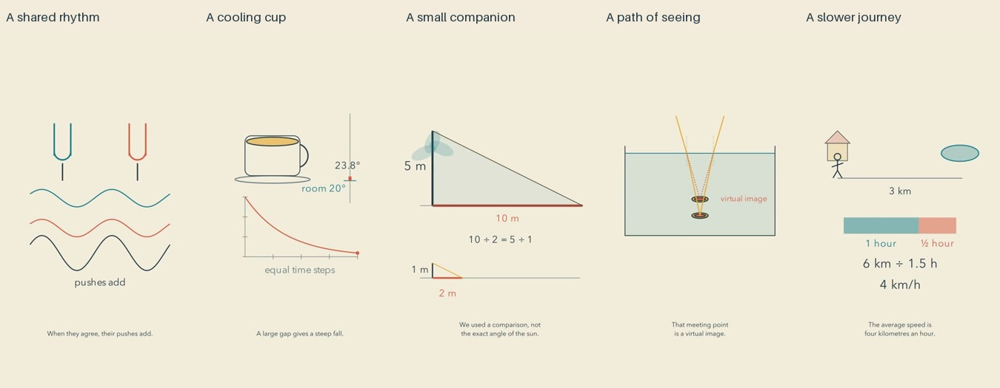

# Everyday objects: release and reflection

Cycle six of the autonomous run. The whole batch passed its final review gate before upload. Independent YouTube readback verified public visibility and successful processing for all five.

| Video | Duration |
| --- | --- |
| [The Gentle Rhythm Between Two Steady Notes](https://www.youtube.com/shorts/buOe3erdRc4) | PT1M21S |
| [The Quiet Curve Inside a Cooling Cup](https://www.youtube.com/shorts/BMH8hlUNd8Q) | PT1M11S |
| [A Tree Measured by Its Smaller Companion](https://www.youtube.com/shorts/p_lexXGyVnM) | PT1M16S |
| [The Coin That Looks Closer Than It Is](https://www.youtube.com/shorts/QF0MEgTBT6s) | PT1M18S |
| [The Average Hidden in a Walk to the Pond](https://www.youtube.com/shorts/xP2UBmu3g00) | PT1M17S |

[Editable sources and tone builder](../examples/objects) accompany [recognition and listening research](research/RECOGNITION-AND-LISTENING.md). Engine change d7bfe8a and scene sources 5f234aa passed GitHub checks.

## What changed

The films introduce tuning forks, a cup with handle and saucer, a tree and stick, a submerged coin, and a walk between home and a pond. Their relevant geometry stays visible as each explanation becomes mathematical. This is an editorial improvement over the preceding batch's more anonymous shapes; recognition and enjoyment have not been measured with viewers.

The beats film contains original mono sine pairs at 220/221 Hz and 220/220.5 Hz. Dedicated speech-free windows let the sound demonstrate its own relationship. Circles follow the real-time absolute envelope; the explanatory carrier waves are explicitly schematic. Full decoded audio envelope correlations were 0.991 and 0.998 against the authored model. These are signal checks, not listening judgments.

Scene-specific paragraph pause lists now permit selected listening or inspection windows without slowing every paragraph. Seventy-eight unit tests and four sample-timeline integration tests passed. Caption and cue timestamps follow inserted samples; cache keys include the overrides. Normal full low-energy paragraph gaps measured 1.25–1.35 seconds. Two listening gaps were intentionally longer, with tones inside them.

## Repairs made before release

Frequency labels were moved off the wave curves. The tree's foliage was constrained below the height used in the similar triangle, and height labels were moved off measured lines. A temperature readout now retains the half degree. Ambiguous cue phrases were expanded. One graph animation was shortened to fit the measured speech cue.

Independent transcription repeatedly heard “halve” as “have” in the tea narration. That line was rewritten as “cuts the remaining gap in half,” re-synthesized, re-rendered, and inspected again. The updated full transcription recovered the revised wording. A native transcription process raised a mutex error during interpreter shutdown after writing its completed report; the saved current report was read and checked. Other differences were number formatting, spelling variants and a trailing word in full-file shadow ASR that did not recur in a focused check.

## Reflection as an editor

The cup is the strongest recognizable object. Its quiet setting feels aligned with the channel's intention in still images. The walking example connects an everyday question to a useful distinction between equal distance and equal time. The tree comparison keeps corresponding sides attached, while the coin explains a virtual position by following light paths. These are judgments from sampled visual evidence, not observed audience responses.

The artistic goal remains only partly achieved. A walker slides without a gait, a pond is an ellipse, and the tree is a sparse icon. The coin is small and has no drawn eye to establish the viewing situation. The tone example does not separately play each steady note. Several endings hold a formula or diagram while the voice generalizes. That can leave little new to inspect, even when the prose is gentle.

The next cycle should test an ending that changes one meaningful condition and visibly answers the resulting question, then returns to the original object with a new way to see it. A calm film can have an eventful ending without a cliffhanger, slogan, or timed quiz. Research should distinguish a viewer generating an explanation from a video merely reciting one. There is no demonstrated quality plateau.

## Evidence and limits

All forty current final sheets were actually inspected: contact and opening-motion sheets, all cue pages, and three critical-interval sheets for each film. Records are bound to export hashes. Independent math checks cover trigonometric superposition, Newton cooling, similar triangles, exact refraction versus its small-angle limit, and harmonic average speed. All final audio decoded without clipping; all authored silence samples were checked.

This review did not include uninterrupted audiovisual watching or subjective listening. It does not establish natural prosody, perceived calm, engagement, reduced anxiety, learning, or retention. No audience outcome has been measured. Credential and PII scanning was targeted to known values and patterns, not proof against every possible unknown secret.
