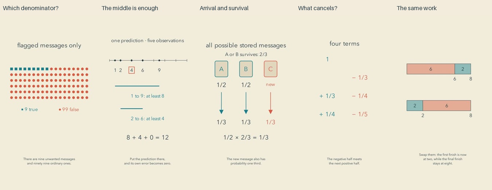

# Mathematical observations: release and reflection

Cycle fifteen. All five current final reviews preceded the first upload. Independent YouTube readback confirmed five public, processed releases.

| Video | Duration |
| --- | --- |
| [When a Flag Is Usually a False Alarm #math #Shorts](https://www.youtube.com/shorts/shSD57QpB10) | PT1M23S |
| [Why the Middle Minimizes the Total Error #math #Shorts](https://www.youtube.com/shorts/1GA7uuFoq6c) | PT1M31S |
| [A Fair Sample Without Keeping the Whole Stream #math #Shorts](https://www.youtube.com/shorts/hFoXSKxZtXk) | PT1M26S |
| [An Infinite Sum with Only Two Loose Ends #math #Shorts](https://www.youtube.com/shorts/CJFIIstOjAU) | PT1M28S |
| [The Same Work, Less Waiting #math #Shorts](https://www.youtube.com/shorts/MTbQ0BQNOjU) | PT1M26S |

[Editable projects](../examples/observations) and [research with source limits](research/MATH-FIRST-EDITORIAL-MIX.md) accompany the films.

## What changed

The channel is mathematics first. Its warm, restrained, contemplative aesthetic is a delivery choice. Applications are open-ended and explicitly include machine learning. Profile 0.7 and the portable editorial-mix reference separate those decisions, while older projects retain their pinned profiles.

This slate deliberately varies the reasoning: a conditioning denominator, an attained lower bound, a probability invariant, finite cancellation and an adjacent exchange argument. There is no geometry-led film. That is a correction to recent repetition, not a permanent ban on geometry or a universal five-topic quota. The public index now contains eighty-five example learning goals. Historical title and mechanism searches still leave transcript gaps, especially around the older broad loss-functions video.

## Repairs from actual inspection

The classifier opening now flags envelope icons. Its tray contains exactly nine true and ninety-nine false flags, and its rounded percentage uses an approximation sign. Recall and precision are defined directly instead of through ambiguous ordinal references.

The median film hides rounded readouts while the prediction moves. Final review caught stale labels returning during fade-in: hidden objects had stopped updating. An explicit refresh before reappearance fixed the two inspected transition samples; the film was rendered and reviewed again. When the outside observation changes from nine to fourteen, the endpoint, bound and total change together. The reservoir film separates one possible sample path from the probability diagram and removes alternative cards at the end to emphasize the one-item memory constraint.

The telescoping film highlights each matched signed term separately. Its heading changes when a fifth term is added, and spoken denominators identify the quantity n plus one. The scheduling film visibly swaps the same job blocks and states the time origin of its relative-time algebra. Later jobs remain unchanged by the adjacent swap.

Independent transcription repeatedly omitted a short instruction in two passages. Those passages were rephrased and synthesized again. A common-denominator sentence and a closing sentence received the same treatment. Current full transcripts were then compared with the intended scripts; remaining differences are number formatting, homophones and a minor inflection, without an identified mathematical change.

## Viewer-centered reflection

The mathematical range is a meaningful improvement. Precision is a practical trap; the median offers a satisfying proof rather than a named rule; reservoir sampling connects a tiny local decision to a global guarantee. A viewer can encounter several ways of thinking instead of another variation on moving geometry.

The artistic result is more mixed. These films often look like calm explanatory slides. Their late sections lean on labels and formulas, and sparse diagrams do not automatically become meditative or beautiful. The algebra film is especially demanding for a viewer who already fears symbols. The scheduling bars and message cards could connect more strongly to recognizable situations without pretending the mathematical model covers every real-world detail.

My editorial hypothesis is that an already-curious viewer has a reason to stay for the denominator surprise or the cancellation. A casual viewer still has several places to leave: the median's static setup, the reservoir's move into symbolic probabilities, and the scheduling assumptions after its main payoff. These are judgments from inspected frames, scripts and construction, not measured retention or a claim of uninterrupted viewing.

The next experiment should make an everyday question or surprising consequence concrete earlier, then preserve that same visible object through the proof. More activity is useful only when it carries meaning. Longer duration alone will not repair a static or abstract explanation. We should research novice interpretation and the transition from examples to general statements, then prototype one coherent visual story before expanding to five. No quality plateau has been established.

## Evidence and limits

All 45 current final sheets were inspected: timeline contacts, opening motion, all cue pages, all three declared critical intervals per film and endings. Review records bind to current export hashes. 

Captioned preview evidence was inspected across all five films, with revised intervals checked after repairs. Exact finite mathematical checks and explicit assumptions accompany every project. Source commit f43069f passed [GitHub CI](https://github.com/nagisanzenin/MathTuber/actions/runs/34007774522) before publication; the median readout repair also passed [CI](https://github.com/nagisanzenin/MathTuber/actions/runs/34008302055). The preceding editorial/plugin update passed the one-hundred-test suite and skill validation.

Current complete narration transcripts were reviewed, inserted pauses checked and full final audio decoded. No clipping was detected by those checks. This is sampled visual, transcription and signal review, not subjective listening or uninterrupted audiovisual viewing. Natural prosody, aesthetic preference, understanding, retention and subscriptions remain unmeasured. Targeted privacy scans are not proof against every unknown secret.
