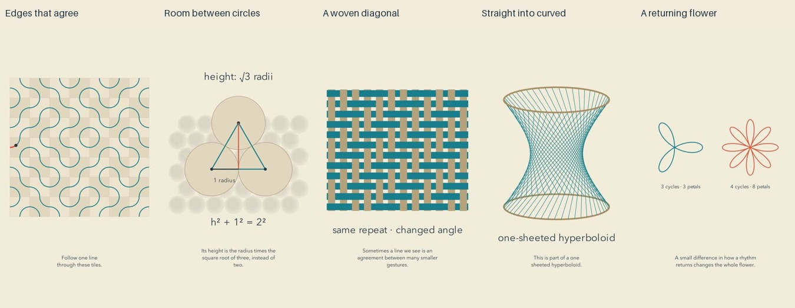

# Patterns: release and reflection

Cycle fourteen. All five current final reviews preceded the first upload. Independent YouTube readback confirmed five public, processed releases.

| Video | Duration |
| --- | --- |
| [A Little Agreement at Every Edge #math #Shorts](https://www.youtube.com/shorts/MKwCWWqd03U) | PT1M2S |
| [The Triangle Between Round Stones #math #Shorts](https://www.youtube.com/shorts/xZlYenBurlg) | PT1M6S |
| [A Diagonal Without a Diagonal Thread #math #Shorts](https://www.youtube.com/shorts/1JxTlt5p-us) | PT1M7S |
| [Straight Lines Can Gather into a Curve #math #Shorts](https://www.youtube.com/shorts/UOGUNuEyzTQ) | PT1M11S |
| [Why Some Mathematical Flowers Retrace #math #Shorts](https://www.youtube.com/shorts/UFnb2ePokjM) | PT1M8S |

[Editable projects](../examples/patterns) and [research](research/PATTERN-AS-EXPLANATION.md) document the mathematical models and the limits of the aesthetic hypothesis.

## What changed

This batch begins with richer patterns and reveals the local relationships that organize them: matching tile edges, touching circles, over-and-under crossings, endpoints of straight lines, and a signed radial rhythm. The whole image returns after an enlarged explanation. Original vector constructions and local narration avoid stock assets and paid generation APIs.

The reusable tile-path model pairs exact edge midpoints, traces connected components, and distinguishes closed loops from routes ending at the boundary. Equal quarter-circle arcs permit constant-distance sampling along these particular paths. This is narrower than a general curve-speed claim. The public mechanism index now contains eighty learning goals, including comparisons with nearby earlier topics. Historical transcript gaps still limit duplicate detection.

## Repairs that mattered

The circle rows now settle without overlapping during the transition: their vertical spacing follows the contact geometry instead of a linear interpolation. Thickened weave ribbons and explicit occlusion make the over-and-under structure visible. Old geometry is removed before the spacing change, and a neutral label replaces the forty-five-degree claim during stretching.

The tile scene preserves unfilled paths by changing stroke opacity explicitly. Its enlarged seam shows why paths continue across neighboring tiles. In the surface film, the sixty-degree label clears its arc, and revised narration identifies the endpoint angle already on screen. The four-cycle flower starts at zero radius, so its first half-turn really draws four complete petals; the ending compares three and eight petals side by side. Cue overruns were shortened and the affected previews were reviewed again.

During release, YouTube rejected a description containing an ASCII less-than sign. The rejected request had not created a resumable upload session. Its receipt was preserved, the inequality was rewritten in words, and publishing resumed using the existing receipts for the three released films. The dry-run validator now rejects angle brackets and invalid UTF-8, and counts the description limit in bytes, so the whole batch catches this problem before its first upload. The regression suite passed one hundred tests. [YouTube metadata reference](https://developers.google.com/youtube/v3/docs/videos#snippet.description).

## Reflection from the inspected evidence

The strongest improvement over the sparse construction batch is that the image has something worth exploring before its explanation begins. The weave feels closer to a material practice. The tile field makes a local agreement visibly consequential. The ruled surface has the strongest sculptural silhouette. These are editorial observations about the inspected frames and construction, not measured audience responses.

The channel still risks sounding like the same lesson repeatedly. The calm voice, paper background and reflective closing sentences form an identity, but the wording often feels impersonal. Some openings defer meaningful change: the packing arrangement remains still for roughly six seconds. The weave has a slow build before its main explanation. Calmness should leave room for attention, not require viewers to wait for a reason to care.

Beginner support is uneven. The packing cell changes scale and introduces percentages after a more accessible row-spacing explanation. The flower assumes the viewer can accept a negative radial distance without first seeing the rhythm on a graph. The surface switches to a labeled top view instead of continuously rotating into it; the half-radius result also relies on elementary triangle knowledge. The weave highlights can be subtle at phone size. Correct mathematics does not remove these interpretation costs.

The next experiment should begin with a concrete observation or a small purposeful action, then let the viewer discover a consequence. Its narration should sound like someone sharing a particular observation, with fewer interchangeable closing aphorisms. Earlier meaningful movement and prerequisite support are candidates for research and prototyping, not universal timing rules. The zen direction remains an aspiration: no evidence yet shows reduced fear of mathematics, joy, meditation or learning.

## Evidence and limits

All 45 current final sheets were actually inspected: timeline contacts, opening motion, all cue pages, all declared critical intervals and endings. The records bind to the current export hashes. 

All twenty-five current preview sheets were inspected, with earlier iterations inspected where repairs were needed. Independent mathematical checks covered exact tile connectivity and tangent joins, nonoverlapping circle motion and lattice density, weaving repeats, the ruled-surface equation and half-turn identities for rose curves. The engine suite passed ninety-five tests, and the source commit passed GitHub CI before publication.

Complete narration transcripts were compared with their intended scripts. Differences were homophones, number formatting, a minor inflection and the transcription of “sheeted”; no mathematical change was identified. Inserted pauses, source signal checks and full final audio decoding passed without detected clipping.

This is sampled visual, transcript and signal review. It is not uninterrupted audiovisual viewing or subjective listening. Natural prosody, aesthetic preference, understanding, retention and subscriptions remain unmeasured. More films and passing checks do not prove better art. No quality plateau is established. Targeted privacy scans do not prove the absence of every unknown secret.
