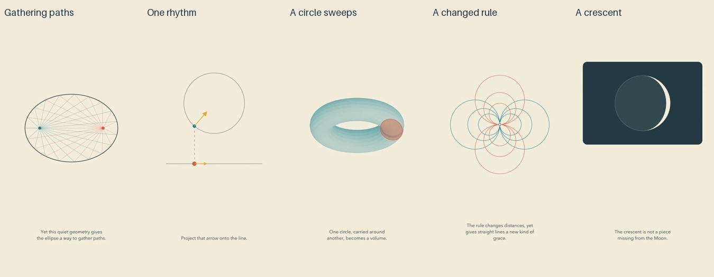

# Quiet batch: release and reflection

Cycle four of the autonomous run. All five complete exports passed the whole-batch gate before upload. Independent YouTube readback verified public visibility and successful processing.

| Video | Duration |
| --- | --- |
| [How an Ellipse Gathers Reflected Paths](https://www.youtube.com/shorts/YgC20_iNPyg) | PT1M38S |
| [A Circle and a Spring Share One Rhythm](https://www.youtube.com/shorts/IH29TELSb8E) | PT1M31S |
| [The Quiet Journey Inside a Ring](https://www.youtube.com/shorts/Ms4Gl4k9Fns) | PT1M36S |
| [When Straight Lines Become Circular Arcs](https://www.youtube.com/shorts/891zC5Ji99A) | PT1M31S |
| [A Crescent Is a Relationship with Light](https://www.youtube.com/shorts/cZslMVwXrC4) | PT1M39S |

[Editable sources](../examples/quiet) and [quiet-beat research](research/QUIET-BEATS.md) accompany this release. Synthesis and rendering ran locally; hardware, subscription and agent time still have costs.

## What changed

Speech can now insert real silence between authored paragraphs, shifting later word and caption timings by the actual sample count. These five films insert four 1.1-second pauses each. Including nearby silence from synthesis, the measured low-energy gaps are about 1.9–2.1 seconds; insertion duration is not the same as the full perceptual gap. The duration is a creative test, not an established optimum from the research. Default synthesis is unchanged, and imported audio rejects this synthesis-only setting.

Validation included 70 unit tests, three media integration tests, a real two-paragraph Kokoro synthesis with verified zero samples and shifted cues, and the skill validator. The source commit passed GitHub checks. Independent mathematical checks cover ellipse reflection and tangent geometry, harmonic projection, the centroid volume theorem, reciprocal inversion, and projected lunar illumination.

## Put a novice in front of the picture

The Moon gives the clearest immediate invitation: an ordinary crescent becomes a relationship between illumination and viewpoint. Its dark panel brings welcome visual variation inside the warm-paper identity. The ring now grows through an actual sweep rather than simply fading into existence. The ellipse's final family of paths and the inversion grid make restrained, expressive endings. These are editorial impressions from inspected images and sequences.

The pauses reduce continuous incoming speech, but they do not automatically make the reasoning easier. The ellipse's auxiliary construction remains demanding: a newcomer must track several endpoints and compare paths. Inversion spends too long defining reciprocal points before showing the promised line-to-circle result. Its similar-triangle explanation assumes geometric familiarity. The ring's tiny paired pieces are separated from the three-dimensional swept volume, leaving a mental integration task. The spring's motion stops at selected states and uses different illustrative speeds in different passages; this helps inspect an arrow but weakens the felt continuity of the physical rhythm.

The next improvement should make the phenomenon visible immediately, keep its key object attached to the explanation, and separate the clock of a physical process from the pacing of narration. That does not mean nonstop motion: comparisons and proofs still need stable states. The aim is one accessible relationship embodied by the scene, with fewer representational jumps. Meaningful improvements remain; no plateau or audience-quality claim is justified yet.

## Repairs and evidence boundaries

Preview inspection corrected labels crossing a construction, a numerical example left visible at the unit circle, and a ring surface appearing before its sweep. The opening ring now demonstrates generation. Narration distinguishes lunar phases from eclipses and explains why orbital tilt matters. Unique cue phrases, fixed animation overruns and consistent zero-force objects resolved production errors.

Every accepted export has hash-bound evidence: twelve distributed frames, every authored cue, eight opening samples and nine samples across each of three declared critical intervals. All current sheets were actually inspected. Full narration was independently transcribed; focused ASR recovered “multiply” and “circular arcs” missed by full-file transcription. Complete final audio decoded without clipping.

These methods do not include uninterrupted audiovisual viewing or subjective listening. They do not establish natural prosody, peaceful feeling, retention, learning, channel recognition or reduced math anxiety. Real viewer evidence is still missing. Dry narration remains intentional. Public files and reachable history received a targeted credential/PII scan, which cannot prove absence of every unknown secret.
