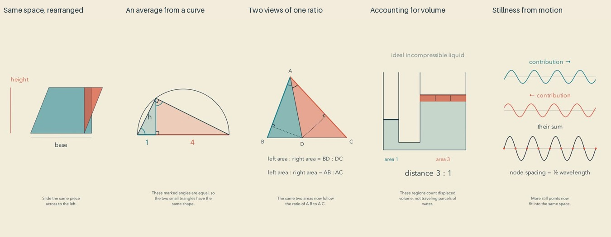

# Visible reasoning: release and reflection

Cycle ten of the autonomous run. The entire batch passed its final review gate before uploading. Independent YouTube readback confirmed all five public and processed.

| Video | Duration |
| --- | --- |
| [The Space That Survives a Changing Outline #math #Shorts](https://www.youtube.com/shorts/jjwKgyfHtN0) | PT50S |
| [The Quiet Average Hidden in a Semicircle #math #Shorts](https://www.youtube.com/shorts/znWhSbWxo7Q) | PT58S |
| [An Equal Angle with an Unequal Secret #math #Shorts](https://www.youtube.com/shorts/If0KwJiAcVw) | PT58S |
| [A Gentle Push and the Price of a Larger Force #math #Shorts](https://www.youtube.com/shorts/ZHVDu12xzDg) | PT1M2S |
| [Stillness Made from Two Moving Waves #math #Shorts](https://www.youtube.com/shorts/W_nQOvGqrAM) | PT1M5S |

[Editable projects](../examples/reasoning) and [primary research](research/VISIBLE-REASONING.md) document the experiment.

## What changed

Every film has a before/change/preserved/after plan. The visual operation is meant to expose a relationship: a triangle tiles a rectangle, a semicircle connects matching side ratios, two area comparisons link ratios, identical pieces account for displaced liquid, and equal opposite wave displacements cancel. The plugin guide uses existing renderer and cue tools. No new API, model subscription or obligatory effect was added.

## Repairs before release

A shear transition originally overran its narration cue; the preceding operation was moved earlier. A repeated fixed-perimeter garden topic was rejected before release and replaced with a geometric-mean construction. Title-only novelty checks had missed this duplication; future selection must compare mechanisms. A wave label was moved clear of crests, and stationary node markers were added at the opening. An uncertain pronunciation was replaced with plain language about waves adding together. The mathematical scale and model conditions are recorded alongside the sources.

## Editorial reflection

The area rearrangement and swept-volume comparison provide the clearest visual evidence: the same pieces can be followed into a new configuration. The semicircle gives the geometric mean a construction, although its similarity step assumes some prior geometry. The wave film combines continuing motion with isolated displacement comparisons. The angle-bisector argument is valid but demands the most prior comfort with letters and area ratios.

These are more explicit explanations, not demonstrated audience gains. The same paper palette and sparse diagram style still dominate. The semicircle begins as a spare static line; the hydraulic apparatus has little material character; the wave has no auditory counterpart. The gap between a correct visual lesson and an evocative small film remains substantial. The next experiment should give the mathematical subject a stronger sense of place and physical character while retaining the visible reasoning. Avoid decorative scenery that competes with the mechanism.

## Evidence and limits

All 42 current final sheets were actually inspected: contact sheets, opening motion, every cue page, all declared critical intervals and complete ending sheets. Inspection records bind to the final export hashes.

Independent calculations verify the authored geometric and physical relationships. Full narration transcriptions were read, selected doubtful passages were checked separately, and the changed wave narration was checked again. The final audio decoded without clipping. Exact inserted paragraph silences and surrounding low-energy intervals were measured.

This is sampled image and signal/transcript review, not uninterrupted audiovisual watching or subjective listening. Recognition, enjoyment, calmness, learning, retention and reduced mathematics anxiety have not been measured. There is no established quality plateau. Publication count and passing checks are not evidence of artistic improvement. Known-value privacy scans cannot exclude every unknown secret.
