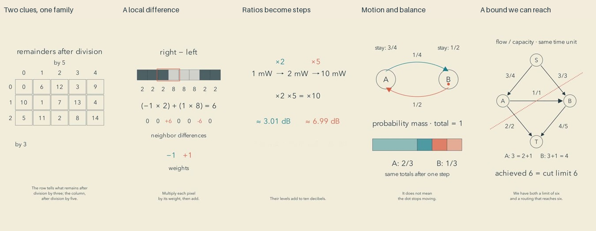

# Mathematical relationships: release and reflection

Cycle sixteen. All five final reviews preceded the first upload. Independent YouTube readback confirmed five public, processed releases.

| Video | Duration |
| --- | --- |
| [Two Remainders Remember a Number #math #Shorts](https://www.youtube.com/shorts/MqS6xrCW4ls) | PT1M39S |
| [A Small Subtraction Finds an Edge #math #Shorts](https://www.youtube.com/shorts/DQbJJOJo57Y) | PT1M32S |
| [When Multiplication Becomes a Step #math #Shorts](https://www.youtube.com/shorts/BarW4H3Arss) | PT1M40S |
| [Moving States, Steady Probabilities #math #Shorts](https://www.youtube.com/shorts/4hEqliopNFE) | PT1M41S |
| [The Limit Between the Endpoints #math #Shorts](https://www.youtube.com/shorts/XgVRDOltDY8) | PT1M27S |

[Editable projects and executable mathematical checks](../examples/relations) accompany the films. [Research and limits](research/EXAMPLES-AND-PRINCIPLES.md) distinguish evidence about printed worked examples from our video-production hypothesis.

## What changed

The five topics cover number theory, local image-filter arithmetic in machine learning, logarithmic measurement, probability and network optimization. Mathematics remains the subject; the warm paper, restrained colors and gentle narration are the delivery. The public mechanism index now contains ninety example learning goals. Comparison against 175 historical titles and the earlier 85 public learning goals found substantive distinctions, but historical transcript gaps prevent an exhaustive novelty claim.

The experiment was to preserve what quantities mean while moving from an example to a relationship. The remainder grid retains the original counting question. A persistent image row connects subtraction, weights and transformed inputs. Power ratios become logarithmic levels. Equal probability exchange motivates a stationary distribution. A single network supplies both an upper bound and a routing that attains it.

## Repairs from actual inspection

In the remainder film, numbers now reach their residue-grid positions before the row and column labels appear. Old grouping labels disappear before regrouping. The filter film removes the old equation before its window moves to a different pair of pixels.

The decibel film no longer enlarges a quantitative bar merely to emphasize it. Gain-stage arrows clear the text. Final inspection also caught an empty visual hold between the power-level chart and gain stages; the chart now stays until the next example begins. The changed final export was inspected again.

The probability film moves state labels out of the exchanged blocks' paths, distinguishes the target from the current probability, removes old step values before changes, and returns to a separately labeled possible path at the end. Two ambiguous spoken phrases were rewritten; the revised independent transcript identifies state A correctly.

Network packets no longer remain over the destination label. The notation switches consistently from capacities to flow/capacity before route assignment, starting with zero flow. Both the initial six-unit flow and the improved seven-unit flow satisfy every capacity and conservation equation.

A source WAV sample near the integer limit exposed a shared-worker issue. Before writing PCM, the worker now attenuates exceptional peaks with one gain across the scene, preserving duration, silence and relative dynamics. Metadata records the input peak and gain. A real-worker test covers floating-point peaks above one, ordinary quiet samples and silence; it runs in CI. This prevents new conversion clipping, not distortion already present in an imported recording.

## Reflection from a viewer's perspective

The best moments have a question and a checkable answer: two leftovers recover a family of counts; a tiny subtraction detects a boundary; an internal cut explains why generous endpoint capacities are insufficient. The network proof earns its conclusion by constructing a flow that reaches the bound. The Markov ending better reconnects its symbols to the process.

The weaker moments still resemble a restrained slide lecture. The decibel film has a valid argument but little tangible setting. The image-filter ending adds two technical names after the useful arithmetic is already visible. The remainder grid requires attention to fifteen entries, and the Markov proof assumes comfort with algebra. Warm colors and silence do not by themselves make these passages inviting or meditative.

As an editorial prediction, an already-curious viewer has a reason to stay for the cut or the paired-remainder puzzle. A casual viewer may leave at a long symbolic transition, or before understanding why the displayed quantity matters. I would not infer a reason to subscribe from visual consistency alone. These are judgments from the actual sampled media, scripts and construction; no human retention, learning, enjoyment or subscription result was measured.

The next experiment should reduce the amount a viewer must hold in mind at once: one central question, a more legible entry point, and a visible consequence that survives through the ending. A relevant concrete setting can help when it clarifies the mathematical model; decorative scenery and extra terminology can also distract. Research should test that design assumption before another five-film slate. More length or more motion alone will not fix it. There is still room to improve; no quality plateau has been demonstrated.

## Evidence and limits

All 45 current final sheets were inspected: distributed contacts, opening motion, all cue pages, three declared critical intervals per film, and endings. The repaired decibel export replaced the earlier rejected visual hold. Review records bind to current export hashes. 

All five complete current narration transcripts were read, paragraph pauses checked and final media decoded. No source or final audio clipping was detected by the current signal checks. Exact finite checks and explicit mathematical arguments accompany the examples. Five public manifests validated, the 100-test suite passed, and the real speech-worker integration test passed. The headroom implementation passed [CI](https://github.com/nagisanzenin/MathTuber/actions/runs/34010850328); the example sources passed [CI](https://github.com/nagisanzenin/MathTuber/actions/runs/34011369012).

This is sampled visual inspection, independent transcription and signal analysis, not uninterrupted audiovisual viewing or subjective listening. Natural prosody and aesthetic preference remain unverified by those methods. Targeted privacy scans found no known credential or personal identifier in the candidate public files; such a scan cannot prove the absence of every unknown secret.
