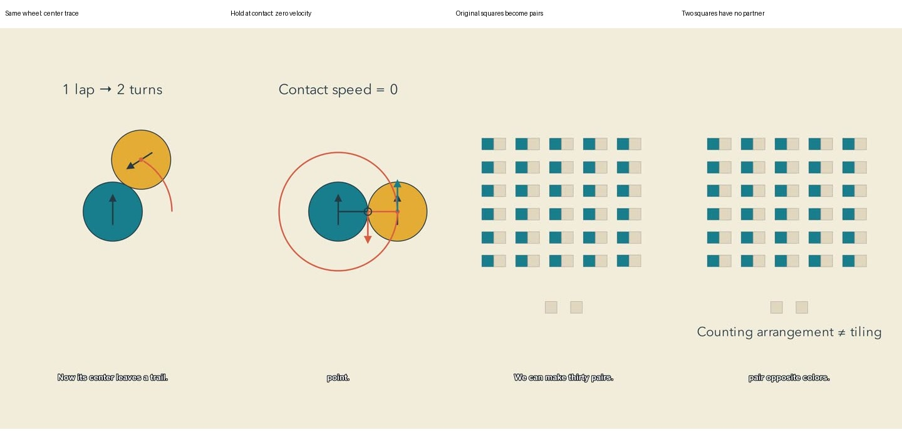

# Mechanism direction: workshop profile 0.2

The previous batch established a palette, but too often explained a picture in narration. This revision asks the picture to do the explanatory work. These are production hypotheses, not measured improvements in retention or learning.

## Reference passage specifications

| Dimension | Coin reference | Pairing reference | Anti-example |
|---|---|---|---|
| Opening | Marked wheel moves immediately; one rotation finishes halfway around | The board itself is the challenge | Logo animation or paragraph before the puzzle |
| Object identity | Same wheel persists through the center-path explanation | Original squares become adjacent pairs | Replacing the objects with unrelated count grids |
| Proof action | Trace the center, mark both radii, resolve zero contact velocity | Thirty explicit pairs leave two light squares without partners | Formula appears while decorative shapes move |
| Motion | Uniform angular movement for physical rolling; hold at contact for reasoning | Staggered relocation for tracking; explicitly a counting rearrangement | Easing the physical wheel while claiming uniform velocity; treating a count rearrangement as a legal tiling |
| Type | Short label at the moment its relationship becomes visible | Pair count after pairing is visible | Permanent headline and duplicate narration paragraph |
| Sound | Dry contact explanation | Dry invariant explanation | Whoosh at every transition |
| Transfer | Change obstacle radius and run the wheel again | Distinguish area from forced color balance | Unrelated subscribe interruption before the payoff |

Editable references live in `examples/mechanisms/references`. Render evidence is added after inspection. Geometry stays exact; the warm palette and restrained outlines identify the channel without forcing one layout. Caption space remains reserved at the bottom. Sound should be tested with actual listening before claiming an artistic mix improvement.

## Workflow

1. Choose a genuinely new mechanism against the channel topic history. Title checking has limits: it cannot establish everything said inside past videos.
2. Author the hardest visual inference first. Render a cheap preview and inspect identity, conservation, causality and phone-scale legibility. Fix before scaling production.
3. Write narration around the actions; compile word cues from synthesized speech. Local synthesis and incremental render caches keep production inexpensive; host subscription inference is not measured here.
4. Finish technical checks: mathematics, current export, caption samples, cue overrun checks, full decode, independent ASR and signal inspection.
5. Write a separate editorial judgment: opening, mechanism, readability, pacing, sound, weaknesses and actual audience evidence. A technical pass is not proof that a video is engaging.
6. Review every batch member before publishing any. `scripts/publish_batch.py --batch batch.json` performs a read-only plan. Add `--publish --credentials <outside-repo-config>` only for an authorized release. Single-video publishing remains available for explicit single-video tasks.
7. Inspect public status and processing after upload. Preserve receipts outside source control. Reflect candidly; do not assign made-up audience scores.

Batch JSON contains a `projects` list. Each entry has `project`, `intent`, and `editorial` paths relative to the batch file. Editorial JSON pins `snapshot` and `export_sha256`, sets `decision: release`, and contains nonempty written observations for `opening`, `mechanism`, `readability`, `pacing`, `sound`, `remaining_weaknesses`, and `audience_evidence`. It is a human/agent judgment record, not an automatic evaluator.

## Formative viewer test (not performed)

Recruit viewers only with authorization. Show the opening without explaining the hypothesis. Ask what they expect next and whether they would continue. Show the complete clip, then ask them to explain the mechanism in their own words and solve one changed example. Ask which exact moment became confusing; record timestamp and explanation. Separately ask about voice, sound, visual appeal and channel recognition. Do not infer learning from liking or recognition from retention. Small samples diagnose problems, not population effects. Alternate versions and order if comparing variants; preserve uncertainty and report recruitment bias. No viewers or outcomes are fabricated when none are available.

## Rendered reference evidence

These samples come from local 1080×1920 renders: coin 51.5 seconds, pairing 45.7 seconds. Adjacent motion samples were also inspected; the coin starts moving immediately and the board squares remain identifiable objects through rearrangement. Full narration was independently transcribed and signal-checked. Number formatting and one tense difference in the pairing ASR did not alter the argument. This was sampled image review plus technical audio review, not continuous audiovisual viewing, subjective listening or a real-viewer test. The pairing motion remains busy during relocation; the settled explicit pairs are the main improvement. References were kept local to avoid republishing old topics.
