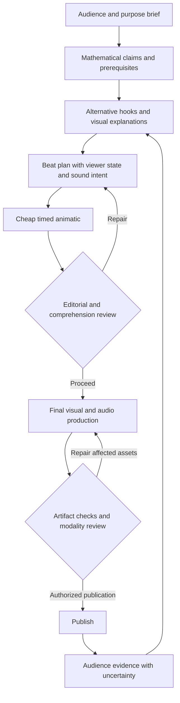

# A research foundation for MathTuber

Research date: 5 September 2026. Status: proposed creative and evaluation architecture, not yet implemented or validated on the channel.

**MathTuber should create enjoyable encounters with mathematical ideas in which the viewer can see a reason, experience a discovery, and leave with something they can use or explain.** Every production choice should serve that experience, including sound, timing, composition, and personality.

The strongest foundation is a collection of mechanisms with explicit boundary conditions and a process for testing our adaptations. There is no established equation for the perfect math Short. A literature-derived rule can be a sensible starting point without being a law of audience behavior.

This is a targeted synthesis of 41 sources, including reviews, experiments, direct short-form research, official platform documentation, and a labeled practitioner perspective. It is not an exhaustive or preregistered systematic review. The companion EVIDENCE.md and evidence.json record findings, access depth, and limitations. Some papers were available only as abstracts or indexed author/publisher excerpts. Many experiments concern university instruction or laboratory tasks, not casual mobile viewing. Recent research is included through August 2026; publication recency is not treated as evidence of greater validity.

**1. Decide what success means before designing a video**

The channel needs several outcomes that sometimes align and sometimes conflict:

| Outcome | What it means | Evidence we can collect | What does not establish it |
|---|---|---|---|
| Attention | A person chooses to watch and remains oriented | Watch-versus-swipe, retention, voluntary exits in a test | A model assigning an engagement score |
| Enjoyment | The experience feels playful, satisfying, moving, or worth the time | Independent viewer reports, choice to watch more | Completion by itself |
| Understanding | A viewer can explain the intended relationship | Explanation and a new application task | Repeating a memorable number |
| Durable learning | The idea remains usable later | Delayed recall and transfer | Immediate familiarity |
| Trust | Claims and illustrations deserve belief | Accuracy audit, source transparency, calibrated viewer confidence | A professional-looking equation |
| Channel attachment | Viewers recognize and voluntarily return | Return behavior, subscriptions, recognition tests | A single viral upload |
| Production efficiency | Quality can be achieved within a resource budget | Iteration cost, render time, model use, reusable assets | Cheapest generation regardless of result |

Research distinguishes learning from short-term performance and perceived fluency. Our evaluation must do the same. [E12: Soderstrom & Bjork](https://bjorklab.psych.ucla.edu/wp-content/uploads/sites/13/2016/11/soderstorm_ra_learningvsperformance.pdf)

Proposed objective: improve enjoyment, understanding and voluntary continued engagement subject to factual integrity, accessibility and resource constraints. Keep these outcomes separate in reports. Do not let excellent retention compensate for a false explanation, or let flawless arithmetic certify entertainment quality.

The user permits 4–5 minutes when needed. YouTube currently limits Shorts to three minutes; longer episodes use the regular-video format. Choose a wider canvas when the explanation benefits from it. [E41: YouTube format rules](https://support.google.com/youtube/answer/15424877?hl=en)

Each brief declares a primary purpose: **spark curiosity**, **deliver an intuitive explanation**, **show a proof**, or **teach a procedure**. These are different jobs. A curiosity piece need not teach a complete proof, but it must not advertise one and then omit it. A 150-second proof can be appropriate; a 45-second curiosity piece can also be appropriate. Duration follows the job and the user's constraint.

**2. Model the viewer's changing experience**

Our proposed organizing model is a recurring sequence:

> Orient → care → anticipate → observe → make sense → try again → remember.

This is a design synthesis, not a named experimentally validated theory. Episodes can repeat or omit steps when justified. A beautiful construction may begin with observation; a tutorial may begin with a desired task; a puzzle may begin with a challenge. Every episode still needs a legible situation and a worthwhile payoff.

For each beat, maintain an explicit account of what a viewer is presumed to know, what remains unresolved, where their attention should go, and what inference becomes possible next. Track two distinct uncertainties:

- **Outcome uncertainty:** “Which die wins?” This can motivate attention.
- **Representation uncertainty:** “Which color is which? What does that arrow mean?” This usually needs repair.

Interest research points to novelty together with perceived ability to understand; curiosity research connects interested states with memory. These provide a basis for approachable questions rather than maximum surprise at any cost. [E05: Silvia](https://libres.uncg.edu/ir/uncg/f/P_Silvia_What_2005.pdf), [E04: Gruber et al.](https://escholarship.org/uc/item/2zd605r7)

Operationally, annotate every unresolved question with its prerequisites, why the viewer should care, the planned answer, and when it is answered. If two prior steps are still unclear, adding a third surprise is unlikely to fix the problem. This is a proposed review heuristic, not a measured working-memory limit.

**3. Teaching should create an attainable inference**

Prefer a concrete question a newcomer can attempt. Show why a plausible answer fails, then reveal a better way to see the problem. In a randomized physics multimedia experiment, explicit misconception refutation and dialogue outperformed concise exposition on conceptual tests. The mechanism is relevant to math explanation, although its transfer to feed retention remains untested. [E06: Muller et al.](https://onlinelibrary.wiley.com/doi/abs/10.1111/j.1365-2729.2007.00248.x)

Use prediction only when the viewer has enough information. “Can you solve this advanced theorem in three seconds?” creates pressure without meaningful participation. An honest binary choice between two visible possibilities can be enough.

Problem-solving before instruction has supportive evidence, but the studied interventions include real attempts and guided consolidation. A rhetorical question is not equivalent. Confusion requires timely resolution and support. [E07: Sinha & Kapur](https://journals.sagepub.com/doi/10.3102/00346543211019105), [E08: Lodge et al.](https://www.frontiersin.org/journals/education/articles/10.3389/feduc.2018.00049/full)

Proposed teaching requirements:

- State the necessary rules through an example when possible, while retaining all rules that materially affect the result.
- Let the viewer finish one small inference before asking for another.
- Distinguish examples, simulations, exhaustive enumeration, and general proof on screen or in narration.
- Reveal the reason for the result before introducing compact notation when targeting beginners.
- Preserve a plain-language account alongside notation; a viewer should not need to decode an unfamiliar symbol to know the claim.
- End with a changed example or a short explanation opportunity. Provide feedback; do not make the answer available only in a later video.

Retrieval and self-explanation research supports active processing, but the production must make room for actual viewer thought. These findings do not support repeatedly demanding comments as a substitute for learning. [E13: Szpunar et al.](https://www.pnas.org/doi/10.1073/pnas.1221764110), [E14: Bisra et al.](https://doi.org/10.1007/s10648-018-9434-x)

**4. Design the mathematical representation before decorating it**

The key visual decision is which relationship becomes directly visible. An attractive image of a bag does not by itself explain reinforcement. A growing collection whose selection probabilities visibly change may do so.

Animation has conditional benefits. Meta-analyses find average advantages, alongside substantial variation; a later synthesis found most individual comparisons were not statistically significant. Our rule is to choose motion because it reveals a relevant change or relationship. [E09: Höffler & Leutner](https://www.leibniz-ipn.de/en/research/publications/instructional-animation-versus-static-pictures-a-meta-analysis), [E10: Berney & Bétrancourt](https://www.sciencedirect.com/science/article/pii/S0360131516301336)

Use an explicit representation contract:

| Mathematical idea | Candidate visual operation | Integrity question |
|---|---|---|
| Equivalence | Rearrange the same pieces | Is quantity preserved throughout? |
| Bijection | Pair objects one-to-one | Are there missing or duplicated partners? |
| Probability | Show labeled equally likely elementary outcomes | Are visual size and sampling weight being confused? |
| Invariance | Change the configuration while tracking an unchanged property | Is the invariant actually established beyond sampled cases? |
| Recursion | Repeat a rule on a smaller instance | Does each repeated operation have the same meaning? |
| Permutation cycles | Follow labels, then rearrange those same objects into loops | Is object identity preserved? |
| Limits | Show successive approximations with an explicit limiting claim | Is a finite animation being mistaken for proof of convergence? |
| Comparison | Hold geometry fixed and change one sampling rule | Can the viewer identify exactly what changed? |

These are proposed MathTuber design primitives. A visual should make the intended reasoning easier to inspect. Static holds, side-by-side comparisons and traces can be better than continuous movement when the viewer must compare states.

Mathematical beauty can be appreciated by nonexperts: research on simple arguments found systematic aesthetic judgments related to clarity, elegance and profundity. This supports taking the beauty of an explanation seriously, without assuming a universal visual style. [E19: Johnson & Steinerberger](https://pubmed.ncbi.nlm.nih.gov/31015078/)

Our creative hypothesis is that a satisfying transformation—many confusing cases becoming one understandable structure—can deliver both intellectual and sensory pleasure. That hypothesis must be tested with the intended audience.

**5. Treat the audiovisual dimensions as a coordinated score**

The following is a proposed production guide informed by the evidence, not a list of established numerical optima.

| Dimension | Intended contribution | Default decision | Failure to look for | Test |
|---|---|---|---|---|
| Topic | Worthwhile question | A surprising relationship with a reachable entry point | Interesting only to the author | Can a newcomer explain the question? |
| Opening image | Immediate orientation and interest | Show the actual puzzle/object already in a meaningful state | Decorative intro before content | First exposure: what is happening? |
| Hook wording | Honest reason to continue | Specific unresolved question or consequence | Vague hype, exaggerated impossibility | Can viewers state the promised payoff? |
| Narrative | Causal progression | Each event changes what can be inferred | A list of facts held together by transitions | Retell the causal sequence |
| Teaching voice | Partnership and confidence | Curious, precise, occasionally playful | Condescension, shaming, breathless authority | Ask about tone separately from correctness |
| Vocal delivery | Focus and emotional contour | Stress decisive words; vary pace around reasoning | Uniform cadence, inappropriate enthusiasm | Blind listening comparison |
| Silence | Thought, contrast and anticipation | Deliberate breathing room for a prediction/reveal | Dead time or no time to think | Observe prediction completion |
| Background music | Mood, continuity and momentum | Optional; adapted to beat function | Masked speech, emotional overstatement | Voice-only versus restrained score |
| Sound effects | Object contact and event emphasis | Sparse, motivated, consistent | A pop/whoosh on every element | Can viewers identify the relevant event? |
| Audio mix | Effortless intelligibility | Narration remains clear on a phone speaker | Audible words but tiring sustained listening | Full playback, low volume and mono checks |
| Object form | Legible action and character | Geometry suited to the concept; tangible detail where useful | Generic clip art or unnecessary realism | Recognize object states at phone scale |
| Layout | Control of attention | Give the active object sufficient area | Tiny central figure and competing headings | First-look and detail-reading checks |
| Color | Identity and meaning | Stable semantic roles with labels/shape redundancy | Decorative recoloring changes apparent identity | Track an object after a transition |
| Typography | Fast, comfortable access | Few hierarchy levels; stable, readable equations | Dense title/caption/equation competition | Read at final viewing size |
| Captions | Access to spoken meaning | Accurate phrase-based timing and safe placement | Isolated words, broken syntax, hidden diagram | Muted comprehension check |
| Motion | Make change visible | Preserve correspondence between before and after | Morph hides the operation or creates false geometry | Describe what changed and what stayed fixed |
| Camera | Reveal the necessary scale | Zoom/pan to follow an object or expose structure | Movement without information | Compare stable and moving-camera versions |
| Edit rhythm | Maintain continuity and progression | Cut at meaningful changes with visual anchors | Viewers repeatedly search for their place | Mark reorientation moments |
| Detail | Texture, personality, credibility | Keep details serving meaning or experience | Decorative competition during reasoning | Remove-one-layer comparison |
| Humor | Shared enjoyment | Let the mathematical situation produce the joke | Ridiculing a wrong guess or obscuring a rule | Enjoyment and explanation tests separately |
| Ending | Satisfaction and competence | Resolve the promise and offer a usable insight | Summary of terminology or withheld answer | New example and desire-to-return check |
| Channel identity | Recognition and expectation | Stable voice, motion and sound vocabulary | Every episode looks like the same slide deck | Recognition without logo, across unfamiliar topics |

Classic multimedia guidance is useful, but a video-specific review finds important boundary conditions, especially around text and audio redundancy. Captions should remain accessible; reduce unnecessary competing text instead of mechanically deleting the spoken transcript. [E02: Fyfield et al.](https://ajet.org.au/index.php/AJET/article/view/7296), [E37: W3C captions guidance](https://www.w3.org/WAI/WCAG21/Understanding/captions-prerecorded.html)

**6. Sound deserves its own design and review**

Music research is mixed. A 2023 meta-analysis found a small overall positive learning effect across diverse settings, while a 2022 review identifies task- and music-dependent costs. Neither supports a universal music-on or music-off policy for narrated math. [E30: de la Mora Velasco et al.](https://journals.sagepub.com/doi/abs/10.1177/03057356231153070), [E29: Cheah et al.](https://journals.sagepub.com/doi/10.1177/20592043221134392)

Our initial sound policy should be:

- **Invitation/play:** a light instrumental texture is a candidate, not mandatory.
- **Prediction:** reduce activity so the audience can think; silence is a valid option.
- **Mechanism/proof:** sparse score or silence, especially under numbers and unfamiliar terminology.
- **Reveal:** allow a brief resolution in music and a meaningful event sound.
- **Transfer/end:** return to clarity, with an optional recognizable closing motif.

Do not adopt a single tempo, loudness difference or genre as scientifically optimal. Select mix settings through actual intelligibility and preference tests. Avoid lyrical music as an initial default under dense narration. Test on speaker and headphones, including ordinary low-volume playback. Archive stems so music and SFX can change without rerendering mathematics.

Older multimedia experiments found costs from extraneous sound. A film experiment also demonstrates that changing a soundtrack can change interpretations of the same scene. Sound therefore participates in meaning; it is not merely polish. [E31: Moreno & Mayer](https://tecfa.unige.ch/tecfa/teaching/methodo/Moreno_Mayer00.pdf), [E32: Ansani et al.](https://pmc.ncbi.nlm.nih.gov/articles/PMC7575867/)

Use a small event vocabulary: contact/opening, selection, correspondence, resolution. Treat these as candidates for testing. A triumphant sound after a simulated win must not imply certainty about the next random outcome. Meaningful sound-only information must also have an accessible visual/caption equivalent.

Voice should be directed beat by beat. A 2024 randomized study found higher reported engagement and follow-up viewing intention with enthusiastic delivery, without conclusive quiz improvement. This is a good example of why perception and learning need separate measures. [E33: Marty-Dugas et al.](https://www.frontiersin.org/journals/education/articles/10.3389/feduc.2024.1339815/full)

Modern synthetic speech can convey affect, but studies of particular engines cannot tell us which current voice works for this channel. Compare actual samples for warmth, clarity, natural emphasis, pronunciation and fatigue. ASR checks wording; it cannot certify charm, expressive intent, or a good music mix. [E34: synthetic voice study](https://pmc.ncbi.nlm.nih.gov/articles/PMC9361884/)

**7. Motion, pacing and style must preserve comprehension**

An animation must remain interpretable while it changes. Film-perception theory also suggests preserving attentional expectations across cuts. Our adaptation is to carry a stable object, spatial anchor or action into the next shot rather than resetting the entire layout at every transition. [E11: Tversky et al.](https://faculty.washington.edu/aragon/classes/hcde411/w13/readings/Tversky_AnimationFacilitate_IJHCS02.pdf), [E35: Smith](https://ualresearchonline.arts.ac.uk/id/eprint/21187/)

Use contrast in pace: brisk setup where information is familiar; slower development at the essential inference; a hold on the successful transformation; then a new application. There is no reviewed evidence for a mandatory cut every two seconds or a universal eight-second attention span. Likewise, the well-known MOOC study does not establish an optimal Shorts duration. [E03: Guo et al.](https://juhokim.com/files/LAS2014-Engagement.pdf)

A consistent channel should have stable **semantics and personality**, with flexible staging. Proposed identity: a playful mathematical workshop where viewers manipulate ideas alongside a precise, warm guide. Test this against a more spare geometric style before committing.

Candidate recognizable features: the way objects become diagrams; restrained tactile contact sounds; a brief musical resolution when a structure becomes clear; conversational invitations to predict; consistent meanings for visual highlights. Avoid a long mandatory intro. Design original assets and record their licenses. For music selection, also check claim restrictions for longer Shorts in YouTube’s current guidance; a usable music license and an absence of automated claims are separate checks.

Sonic-logo research distinguishes recognition from recall. We should test whether a signature identifies the channel and is pleasant, rather than assuming a memorable tune guarantees loyalty. Interest-development theory similarly distinguishes a caught attention from an enduring interest. [E36: sonic-logo research](https://www.repository.cam.ac.uk/items/903c50f3-6d66-4721-af94-7c037073b139), [E20: Hidi & Renninger](https://www.tandfonline.com/doi/abs/10.1207/s15326985ep4102_4)

**8. Identify interactions before optimizing individual features**

| Interaction | Why isolated optimization can fail | Proposed comparison |
|---|---|---|
| Music × reasoning difficulty | An appealing score may compete with a demanding explanation | Music on/off across easy and demanding beats |
| Narration × captions × equations | Three verbal streams can compete despite each being readable | Same captions, reduced heading duplication |
| Motion × prior knowledge | A fluent transformation may conceal an unfamiliar step | Continuous morph versus staged explanation |
| Surprise × prerequisite knowledge | A contradiction is interesting only if the initial expectation exists | Pretrained and untrained audience groups |
| Humor × trust | A joke may help affinity or make the result seem unreliable | Same explanation with/without a relevant joke |
| Pace × language fluency | Fast delivery may exclude otherwise interested viewers | Natural versus reduced-density narration |
| Tangibility × abstraction | Physical details may aid entry but dominate what is remembered | Concrete opening with explicit diagram mapping |
| Identity × novelty | Repetition can support recognition and also cause fatigue | Stable visual meanings, varied scene composition |
| Hook × payoff | A stronger promise can increase entry and later disappointment | Measure expectation fulfillment and full retention |

These are testable hypotheses. We should not exhaustively enumerate every combination. Resolve large conceptual failures first, then investigate a small number of likely interactions.

**9. What direct short-form evidence does and does not tell us**

A July 2026 science-TikTok study associates humor and imitation with engagement. Another study associates different features with knowledge-related comment exchange. These outcomes can diverge, and neither establishes durable learning by the silent majority. [E21: Bunquin & Cohen](https://journals.sagepub.com/doi/abs/10.1177/09636625261469057), [E22: knowledge construction](https://www.sciencedirect.com/science/article/abs/pii/S0360131523001732)

ReelsEd provides a small study of generated educational reels; PaperTok provides recent research on iterative AI video authoring. Both are useful precedents, but neither validates an autonomous system producing reliably captivating, mathematically instructive Shorts. [E24: ReelsEd](https://arxiv.org/html/2509.05962v1), [E25: PaperTok](https://arxiv.org/html/2601.18218v1)

A 2026 bibliometric preprint also finds inconsistent definitions of educational short videos. We should therefore retain context in every imported rule: population, content, task, medium and outcome. [E26: Zhang et al.](https://arxiv.org/abs/2608.06932)

Engagement-focused narrative and emotional design can be appropriate. They should support the mathematical relationship rather than encourage a misleading generalization from one staged example. [E15: Dahlstrom](https://www.pnas.org/doi/10.1073/pnas.1320645111), [E16: Berger & Milkman](https://doi.org/10.1509/jmr.10.0353)

Coherence is compatible with beauty: pleasant instructional graphics have shown benefits, while interesting irrelevant details can hurt learning. The design decision concerns function in this particular beat, not whether an element is aesthetically attractive. [E17: emotional design](https://www.sciencedirect.com/science/article/pii/S1747938X18302148), [E18: seductive details](https://doi.org/10.1007/s10648-020-09522-4)

**10. Apply this to the five current videos**

These are proposed redesigns based on the prior artifact review, not measured audience reactions.

| Video | Main intervention | Visual and sound treatment | Learning check |
|---|---|---|---|
| Efron's dice | Let the viewer choose before revealing the full cycle | Large dice/faces; selection clicks; enumerate one matchup; close the cycle with a visual and musical resolution | Pick the counter to a different die and explain why an advantage is not certainty |
| 100 prisoners | Follow one prisoner closely before exposing global structure | Boxes open, numbers lead to boxes, then the same boxes arrange into loops; quiet during the key inference | Explain why a loop longer than 50 causes failure; exact probability only if justified within scope |
| Bertrand | Make the competing sampling machines visible | Preserve circle and threshold; compare spatial sampling patterns; stable identity cues across methods | Explain how two uses of 'random' can define different experiments |
| Sperner | Turn recoloring into an attempted escape | Zoom on one triangle before the mesh; visibly track disappearances and appearances; demonstrate doorway cases individually | Explain why an unmatched entrance forces an internal endpoint |
| Pólya | Preserve the physical process while comparing histories | Draw-return-duplicate actions; compare repeated experiments with coin flips; group equally weighted histories visibly | Distinguish symmetric rules from balanced outcomes in one run |

For dice, use exact enumeration for the winning probability. An illustrative roll is not proof. For prisoners, a small example can establish the strategy but must not imply the 100-prisoner probability is unchanged. For Bertrand, distinguish finite simulation estimates from exact geometric probabilities. For Sperner, sampled colorings illustrate the invariant; the path argument supplies justification. For Pólya, changing initial marble counts changes the uniform-count result.

**11. Translate the theory into an agentic architecture**

The native agent remains the director. Portable tools execute rendering, audio, checks, asset management and publication. The theory supplies explicit decisions and review evidence, not a rigid four-scene template.

Required artifacts are: audience brief; claim/prerequisite graph; evidence-linked design decisions; alternative concepts; beat plan; representation contracts; style and sound guide; animatic; final media; separate review records; publication receipt; and an experiment record. The companion SYSTEM.md specifies them.

The multimodal critic must inspect actual output. Distinguish mathematical validation, sampled visual inspection, continuous motion review, ASR, signal analysis, actual listening, and human feedback. Missing a modality remains missing evidence. It must never silently become a pass.

A model can identify an undefined symbol or a misleading frame. Its prediction of boredom is a hypothesis until calibrated against people. Separate the generation rationale from the critic's first pass; ask for specific moments and consequences; reverse ordering in pairwise comparisons. Model-judge research motivates these precautions, but it does not validate a simulated audience for our videos. [E38: Zheng et al.](https://arxiv.org/abs/2306.05685), [E39: human-surrogate limits](https://pmc.ncbi.nlm.nih.gov/articles/PMC12184514/)

Autonomy does not require fictional certainty. The system can produce and publish under standing authorization while recording that audience validation is pending. Claims of validated quality require the corresponding evidence.

**12. Build an experimental learning loop**

Begin with the dice remake. First correct orientation, representation and claim integrity. Then test the biggest uncertainty before polishing all dimensions.

Suggested sequence:

1. Prepare two rough treatments of the same learning objective: existing exposition structure and a choice-driven reveal. Equalize the core mathematical content as far as practical; record remaining differences.
2. Use a small formative group of unfamiliar viewers to find obvious confusion. Five to eight people is a practical starting budget, not statistical validation. Avoid explaining the video before showing it.
3. Measure unaided explanation and a changed example before revealing answers. Ask separately about enjoyment, trust and willingness to watch another.
4. For a causal comparison, assign different viewers randomly to versions. Do not show both versions to the same person for a first-learning test; the first teaches the second. Pairwise viewing can still test preference, with randomized order and a different interpretation.
5. Compare audio treatments on the stronger explanation: voice only versus a restrained score with motivated SFX. If learning costs seem concentrated at difficult moments, investigate a music-by-complexity interaction.
6. Repeat the promising treatment on a different topic. A dice-specific result does not automatically transfer to geometry or topology.
7. Add a delayed recall/transfer task to a later validation round. Record actual returning behavior when possible, rather than only stated intention.

Before a confirmatory test, declare the primary outcome, smallest worthwhile improvement, tolerable comprehension loss, sample-size rationale and stopping rule. Estimate sample needs from pilot variance or a power analysis; do not choose a universal viewer count. With small samples, report raw counts, uncertainty and observations. 'No significant difference' is not proof of equivalence.

For channel observations, save video duration, topic, hook, style/audio versions, audience and traffic mix, publication age, and metric definitions. YouTube's official documents describe several ranking signals, not a guaranteed retention target. Average percentage viewed among engaged views has a different denominator from feed exposure. [E27: discovery](https://support.google.com/youtube/answer/11914225?co=YOUTUBE._YTVideoType%3Dshorts&hl=en-GB), [E28: metrics](https://support.google.com/youtube/answer/12220281?co=GENIE.Platform%3DDesktop&hl=en-9)

An organic reupload is not a randomized A/B test: recommendation, topic demand, time and audience change. Retention spikes can reflect delight, confusion, or replay. Investigate before assigning meaning. Comments are useful leads but not a representative learning sample. Keep raw participant information and credentials out of the public repository; share de-identified aggregates only.

**13. Rules the system should refuse to treat as established science**

- A universally optimal length, word rate, cut interval, color palette or music tempo.
- 'Dopamine hacks' as a precise explanation of retention.
- More animation, more realism or more enthusiasm necessarily producing more learning.
- Mandatory constant music, mandatory silence, or automatic deletion of captions.
- A surprising claim excusing a misleading setup or omitted assumption.
- A small simulation establishing an exact probability or a general theorem.
- High completion, likes or self-reported understanding establishing durable learning.
- Many synthetic reviewers being equivalent to many human viewers.
- A model's high confidence or a renderer's success establishing editorial quality.

The channel's creative promise should be tested as an experience: **“I came for an intriguing puzzle; I stayed because I could follow it; I left with a new way to see something.”** The proposed system exists to make that promise concrete, inspectable and progressively better supported by evidence.
