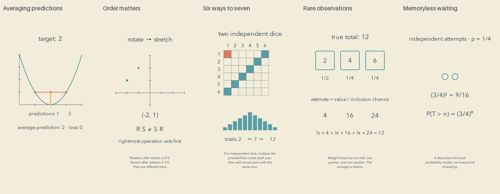

# Synthesis: final batch and reflection

Cycle twenty completes the authorized production run. All five current final reviews preceded the first upload. Independent YouTube API readback confirmed public visibility and successful processing for each export.

| Video | Duration |
| --- | --- |
| [Why Averaging Predictions Can Reduce Squared Error #math #Shorts](https://www.youtube.com/shorts/UH8ALX7OrVk) | PT1M13S |
| [The Same Two Operations Can Lead Somewhere Else #math #Shorts](https://www.youtube.com/shorts/RnL2D5tlPDY) | PT1M8S |
| [Why Seven Has Six Ways to Arrive #math #Shorts](https://www.youtube.com/shorts/QD16nB5neAU) | PT1M10S |
| [Why a Rarely Seen Item Can Carry More Weight #math #Shorts](https://www.youtube.com/shorts/Dk6o9A7DDE0) | PT1M15S |
| [When Waiting Longer Does Not Bring Success Closer #math #Shorts](https://www.youtube.com/shorts/8DgM19zXYLg) | PT1M9S |

[Editable sources](../examples/synthesis) include narration, scene code, pinned profile, review intervals and mathematical verification. The mechanism index contains 110 examples, including 100 from the twenty-cycle autonomous run.

## What a viewer can take away

The dice film is the most immediately countable: six visible pairs make seven, one makes two, and copying a roll changes the answer despite unchanged individual distributions. The transformation film offers a compact experiment to repeat. Both leave a concrete question a viewer can answer without remembering a theorem's name.

Averaging predictions shows a useful machine-learning guarantee with its exact comparison: the loss of the average versus the average loss. The changed target prevents the stronger, false takeaway that an ensemble must beat its best member. The sampling film distinguishes unbiased estimation from exact individual outcomes. Waiting contrasts independent attempts with a changing bag. Those boundaries give the content substance, but probability and expectation remain prerequisites for parts of the explanation.

## Candid artistic assessment

The restrained palette, generous space and gentle staging form a coherent identity. They do not yet constitute exceptional artistic storytelling. Many middles still hold a diagram while narration supplies the reasoning. The sampling film has particularly long stretches of static arithmetic; the small point in the composition film is legible but visually modest. There is little material richness, musical development or surprising visual metaphor in this batch. Removing unnecessary decoration serves clarity, but sparse is not automatically captivating or peaceful.

From the inspected samples, a mathematically curious viewer has something to follow. A casual viewer could skip the abstract openings or lose interest during long holds. This is an editorial judgment, not measured retention. No audience study establishes greater learning, less math anxiety, joy, or preference over prior work.

The run stops at the requested twenty-cycle cap, not because quality cannot improve further. A next experiment should be smaller and measured: take two strong mechanisms, build genuinely different openings and visual developments, and test comprehension and willingness to continue with fresh viewers. More volume from the same author's self-review would not establish those outcomes.

## Repairs and reusable knowledge

Speech inspection motivated replacing ambiguous spoken variable names in the averaging film with “any two predictions.” Final frame inspection then caught a distinct semantic error: a label called the value 1 an average prediction when it was the loss of the average; the prediction remained 2. The label was corrected, the export rebuilt, and all current evidence pages re-inspected before acceptance. This demonstrates why correct narration and correct calculations do not certify on-screen labels.

The installed plugin now includes [comparison decisions](../plugins/mathtuber/skills/mathtuber/references/annotated-decisions.md): name both compared quantities, state shared conditions, and choose a changed case that makes the boundary visible. Navigation, searchable repairs, tested primitives and runnable recipes support another agent without this conversation. They are scaffolding for judgment; [independent model evaluation](HANDOFF-EVALUATION.md) remains unperformed.

## Actual review scope

All 65 current final evidence pages were viewed: distributed timeline, all cues, opening, three critical intervals and ending for every film. Complete source ASR was read against authored narration. Numeric formatting, joined RS/SR punctuation, dependence/dependents, others/other is and waiting/weighting were recorded as recognition discrepancies. No identified numeric claim changed. Full source and final signal checks measured zero clipping and at most 1.3 seconds of low energy. Several native ASR processes terminated with a mutex error; subsequent calls returned complete current reports. This is an unresolved local dependency reliability issue, not a claimed engine fix.

All final exports fully decoded. Exact computations accompany general mathematical arguments: the squared-loss identity, composition of specified maps, all ordered dice pairs, inverse-inclusion expectation and geometric tail cancellation. Finite checks do not replace proofs outside their checked domain.

Review was sampled visual inspection plus full-source transcription and signal measurements. It was not continuous audiovisual playback, subjective listening, an independent evaluator or an audience-quality benchmark.
