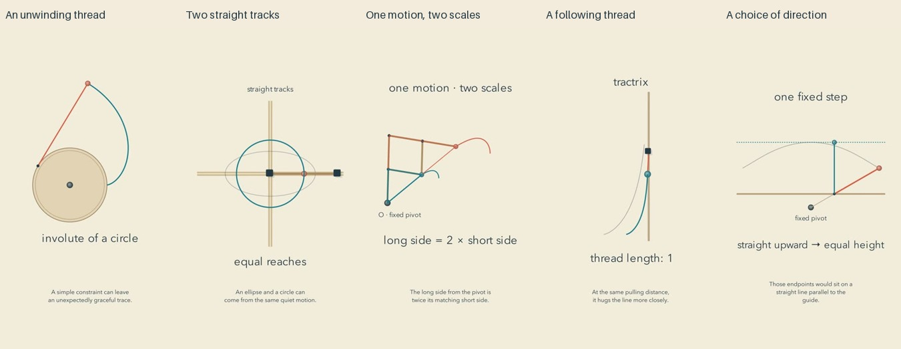

# Continuous construction: release and reflection

Cycle thirteen. All five current final reviews preceded the first upload. Independent YouTube readback confirmed public, processed releases.

| Video | Duration |
| --- | --- |
| [The Curve Left by a Quiet Thread #math #Shorts](https://www.youtube.com/shorts/6wma0DuG1KM) | PT1M2S |
| [Two Straight Tracks and One Gentle Curve #math #Shorts](https://www.youtube.com/shorts/f4jCzmJCRCo) | PT1M3S |
| [The Rods That Quietly Copy a Shape #math #Shorts](https://www.youtube.com/shorts/wiMezgsmeJg) | PT1M3S |
| [The Curve at the End of a Taut Thread #math #Shorts](https://www.youtube.com/shorts/iymwPIz6Z0w) | PT1M5S |
| [The Same Step Can Reach Different Heights #math #Shorts](https://www.youtube.com/shorts/R39XXP2403Y) | PT59S |

[Editable projects](../examples/traces) and [research](research/CONTINUOUS-CONSTRUCTION.md) document the models and evidence boundaries.

## What changed

A visible operation leaves a persistent trace: an unwinding thread, perpendicular sliders, a copying linkage, a fixed-length follower and a rotating fixed step. Motion pauses where the constraint can be inspected, then resumes under a changed condition. Earlier traces become subdued references. A cached geometric polyline supports forward drawing and honest rewinding without repeatedly evaluating the full curve. It samples the authored parameter, not arc length, and makes no claim about physical velocity.

The constructions use original vector geometry and local narration. No paid image generation, stock media or model API was needed. The public mechanism index includes these five learning goals and comparisons with nearby earlier topics; historical transcript gaps remain a limit on duplicate detection.

## Repairs that mattered

The spool was enlarged, and the already-drawn curve subdued during the arc-length comparison. A closing movement was shortened after the cue guard caught an overrun. The pantograph now shows a small triangle enlarging onto its larger counterpart; plain-language length labels replaced tiny symbolic references. Four additional final frames verify that transition. The tractrix guide was centered. The offset example uses a larger step, an upright angle reference, and neutral wording during the tilt before claiming half the height.

## Reflection from the inspected evidence

The strongest feature is the connection between a simple local rule and a visible global curve. The slider film keeps an ellipse beside the circle made by changing the pencil position. The pantograph gives a reason for scaling rather than merely displaying two matching shapes. The conchoid film makes direction part of the meaning of a measurement. These are editorial observations about the explanation, not measured viewer responses.

The films remain very sparse. Their isolated constructions are legible but offer little sense of place or material practice. Repeated paper backgrounds, small moving points and the same calm voice can become monotonous across a channel. The pantograph still asks more of a beginner than the other examples. A name such as tractrix or conchoid is less valuable than noticing the governing relationship. Near the tractrix guide, finite pixels cannot show the strict mathematical separation. Most importantly, calm styling has not established joy, peace or reduced mathematical fear.

The next prototype should explore a richer whole pattern and reveal how a simple local choice organizes it, with an ordinary craft or material as context where it is truthful. The pattern itself should carry the image; adding unrelated decoration would not resolve the weakness. A small visual uncertainty can invite discovery, but the viewer needs a clear, achievable route to understanding. No formula for ideal ambiguity or pacing follows from this editorial proposal.

## Evidence and limits

All 44 current final sheets were actually inspected: contacts, opening motion, all cue pages, declared critical intervals, endings, and the additional triangle-scaling sequence. Records bind to current export hashes. 

Independent algebraic/numerical checks and complete narration transcripts were reviewed. Transcription differences were minor homophones, an article, number formatting and the spelling of conchoid; no mathematical change was identified. Inserted pause samples and surrounding low-energy gaps passed, as did final decoding and clipping checks. The engine suite passed 92 tests and source CI passed before production.

This is sampled visual, transcript and signal review, not uninterrupted audiovisual viewing or subjective listening. Artistic preference, natural prosody, recognition, retention, learning and reduced anxiety remain unmeasured. More published films and passing checks are not evidence of superior art. No established plateau or universal optimum is claimed. Targeted privacy scans do not prove the absence of every unknown secret.
