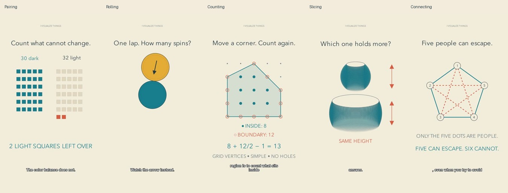

# Workshop profile batch

Five original Shorts using the candidate `ivisualizethings-workshop` profile. YouTube API checks confirm public visibility and successful processing. Topic selection compared the current 160-video upload-title history; related general principles may have appeared before.

| Video | Duration | Mechanism |
|---|---|---|
| [The Chessboard That Defeats Every Domino Arrangement #math #Shorts](https://www.youtube.com/shorts/InKPkOTt6TE) | PT1M48S | Pairing |
| [One Lap. Two Spins. The Rolling Coin Trick #math #Shorts](https://www.youtube.com/shorts/9MFKxbRfYXM) | PT1M51S | Rolling |
| [Find This Area Without Measuring a Single Side #math #Shorts](https://www.youtube.com/shorts/1XmOlFR-Rqc) | PT1M58S | Counting |
| [Different-Sized Balls. Exactly the Same Leftover Volume. #math #Shorts](https://www.youtube.com/shorts/D2Fv4f7GeLM) | PT1M49S | Slicing |
| [Six People Force a Pattern You Cannot Avoid #math #Shorts](https://www.youtube.com/shorts/d4qdagxRuUg) | PT1M48S | Connecting |

## What changed

A pinned profile supplies a channel promise, material and color language, type roles, motion and sound guidance, constraints, examples and exceptions. Each project makes its own format and episode choices. The agent remains responsible for solving, scripting, composing, inspecting and repairing; no LLM API orchestrator was introduced.

The warm workshop direction is a candidate, not an audience-tested optimum. These are five applications across topics, not a controlled aesthetic comparison. Source files and reproducible score generation are in [examples/workshop](../examples/workshop/README.md).

## Verification and repairs

- 44 engine tests and a native profile-aware render smoke check passed. The standalone score script reproduced the original WAV bytes in a renamed project directory.
- Exact mathematical examples were checked. All 32,768 two-color K6 graphs contain a monochromatic triangle; a five-cycle and its complement form the counterexample on five vertices.
- Preview and final captioned samples were actually inspected, including adjacent frames of an opening mechanism. All video/audio streams were decoded; all narration was independently transcribed and differences reviewed.
- Repairs addressed cue overrun, pale square contrast, drilled-hole visibility, a label after relationship types swapped, clearer spoken variable naming, and shared-edge points in the lattice explanation.
- A punctuation-only caption flash was discovered after the first two uploads. The formatter now attaches punctuation to the preceding caption; the remaining three videos were rebuilt. The original first two uploads were retained and may still contain brief punctuation flashes.

## Local rendering measurements

The current final-scene render worker times sum to roughly 82–109 seconds per video. This excludes authoring, speech, preview repairs, assembly, transcription, review and upload; it is not an end-to-end latency or comparative speed claim. Speech and rendering used local tools; the engine did not call a reasoning-model API.

## Limits

No uninterrupted human-style audiovisual review or subjective listening was performed by this text/image host. Audio checks establish technical delivery, not pleasant prosody or artistic mix balance. The lattice video explicitly offers a proof sketch and links the full derivation. The ring diagrams are axonometric illustrations. Recognition, enjoyment, comprehension, retention and return behavior have not been measured with viewers.

Future batches should finish common caption/style review before any member is published. Preserve the identity while testing episode-specific compositions; do not confuse repeating a layout with making a channel recognizable.

Credentials and private production state remain outside the repository. Generated speech and MP4 files are not committed. The first two released exports retain their original pre-caption-fix production provenance; refreshing an engine must not cause accidental duplicate publication.
